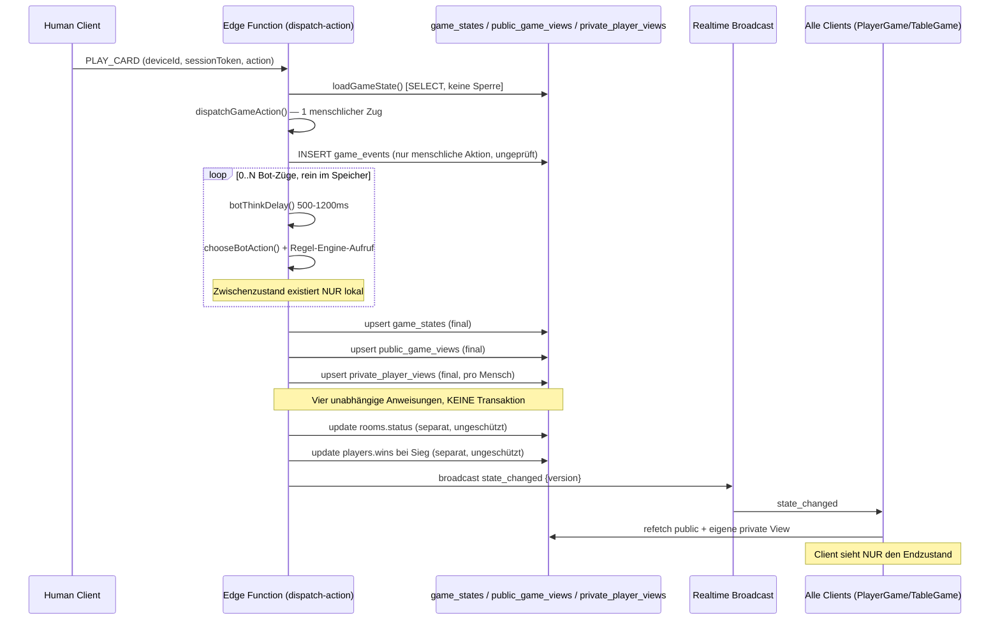
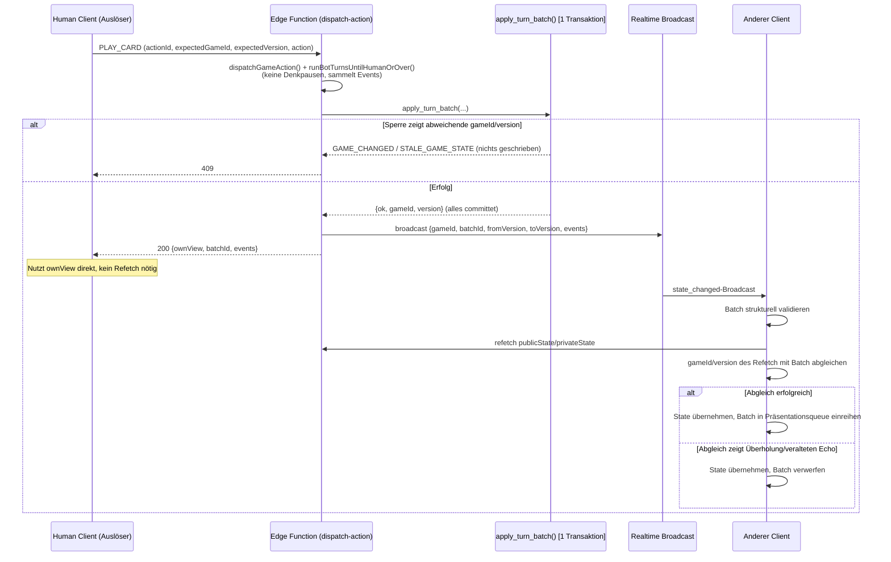

# Bot-Turn-Sichtbarkeit — Technische Untersuchung & Architekturvorschlag (Fassung 8)

**Status: Phase 5A — reine Untersuchung. Kein Code, keine Datenbank, keine Edge Function, keine Tests und keine Abhängigkeit wurde verändert.**

Diese Fassung schließt vier verbliebene Lücken der Fassung 6: (1) die Sequenzprüfung `max(sequence)=count-1` UND `distinct=count` erkannte den Fall zweier Events mit `sequence=[-1, 1]` nicht (max und distinct stimmten zufällig, obwohl `0` fehlte und `-1` ungültig war) — korrigiert auf einen expliziten Abgleich der vorhandenen Sequenzwerte gegen `generate_series(0, count-1)`. (2) die Deployment-Reihenfolge enthielt einen inneren Widerspruch: einerseits sollte der neue Client „gefahrlos vor Migration Schritt 1" laufen dürfen, andererseits musste die Verifikation wegen weiterhin schreibenden Altcodes wiederholt werden — beides ersetzt durch einen einzigen verbindlichen Standard mit kurzem Schreib-Wartungsfenster (Aktionen blockieren → Migration 1 → Backfill wiederholen → Verifikation → Client und Edge Functions **gemeinsam** → Smoke-Test → Migration 2 → Fenster beenden), inkl. expliziter Beschreibung des Verhaltens bereits offener alter Tabs. (3) §4.3 enthielt noch eine veraltete Erwähnung von `fromVersion=1` für einen neuen Rundenbatch, korrigiert auf `fromVersion=0`. (4) `PendingGameEvent.payload` war als `Record<string, unknown>` typisiert, was eine versehentliche Übertragung privater Karten-IDs strukturell nicht verhindert hätte — ergänzt um ein geschlossenes `EventPayloadByType`-Schema pro Eventtyp plus eine laufzeitprüfende `sanitizeEventPayload()`-Funktion (Abschnitt 7.5); der bestehende Test auf fremde `instanceId` bleibt als zusätzliche, unabhängige Absicherung erhalten.

**Fassung 8** gleicht das Dokument an das tatsächlich implementierte und notwendige Verhalten für den Randfall „sofortiger Bot-Sieg direkt nach `START_GAME`/`NEXT_ROUND`" an (Pakete 0B/2/3 sind bereits entsprechend umgesetzt, siehe `supabase/migrations/0005_turn_batches_backfill.sql` und `supabase/functions/start-game/index.ts`/`next-round/index.ts`): endet die sofortige Bot-Kette direkt nach dem Anlegen einer neuen Runde bereits mit `GAME_OVER` (z. B. durch die Mercy-Regel), müssen `START_GAME`/`NEXT_ROUND` auch `rooms.status='FINISHED'` erreichen dürfen — vorher verlangte die Übergangsmatrix hier fälschlich ausschließlich `PLAYING`. Korrigiert wurden die Übergangsmatrix (§5.3), die Gewinner-Validierung (§5.3.1, jetzt für alle drei Übergänge statt nur `NORMAL_ACTION`), der SQL-Pseudocode (§5.4, `p_room_status`-Zielwert-Check und `v_new_version`-Untergrenzen-Check für `START_GAME`/`NEXT_ROUND`, sowie die Gewinner-Prüfung), sowie die zugehörigen Abnahmekriterien und der Testplan (§12/§14, inkl. neuem Testfall). Abschnitte, die inhaltlich unverändert korrekt waren, sind unverändert übernommen.

---

## 1. Bestandsaufnahme: wie der heutige Ablauf tatsächlich funktioniert

### 1.1 `botLoop.ts` — der Kern des Sichtbarkeitsproblems

`supabase/functions/_shared/botLoop.ts::runBotTurnsUntilHumanOrOver()`:

- Nimmt einen **In-Memory-`GameState`** entgegen und gibt einen neuen In-Memory-`GameState` zurück.
- Läuft in einer `while`-Schleife (Guard bei 500 Iterationen), die so lange weiterläuft, wie `currentPlayer.type === "BOT"` und `phase !== "GAME_OVER"`.
- Pro Bot-Zug: `await botThinkDelay()` (500–1200 ms `setTimeout`, rein kosmetisch), dann genau **ein** Regel-Engine-Aufruf.
- **Keine Persistierung, kein Broadcast, kein `game_events`-Insert innerhalb der Schleife.**
- Bot-Entscheidungen und alle Kartenmischungen/-ziehungen nutzen `Math.random()` ohne festen Seed — die Bot-Kette ist **nicht deterministisch und nicht wiederholbar**.

### 1.2 Aufrufer: `dispatch-action`, `start-game`, `next-round`, `replace-with-bot`

Alle vier Edge Functions folgen demselben Muster:

```
state = <lade oder erzeuge State>
state = <wende genau EINE menschliche/strukturelle Änderung an>
state = await runBotTurnsUntilHumanOrOver(admin, state)   // 0..N Bot-Züge, komplett im Speicher
await persistAndBroadcast(admin, state)                    // mehrere unabhängige Schreibvorgänge, EIN Broadcast
```

- `dispatch-action`: lädt State per `loadGameState()` (einfaches `select().single()`, keine Sperre), wendet die menschliche Aktion an, fügt einen `game_events`-Eintrag ein (ungeprüft), lässt die Bot-Kette laufen, persistiert danach.
- `start-game`/`next-round`: erzeugen einen frischen `GameState` (`createNewGame`), lassen sofort die Bot-Kette laufen, persistieren danach.
- `replace-with-bot`: lädt State, flippt einen Spieler-Typ auf `BOT`, lässt die Bot-Kette laufen, persistiert danach.

**Neuer, für diese Fassung entscheidender Fund** (siehe Code): `src/game/gameState.ts::createNewGame()` setzt `version: 1` fest (Zeile 88) — **unabhängig davon, ob es sich um das erste Spiel im Raum oder um „Nächste Runde" handelt**. `supabase/functions/next-round/index.ts` ruft exakt dieselbe `createNewGame()`-Funktion erneut auf, für **denselben** `room_id`. Das bedeutet: `GameState.version` beginnt bei **jeder neuen Runde im selben Raum wieder bei 1** — `room_id` bleibt stabil, aber die Versionszählung ist nur **innerhalb einer Runde** eindeutig, nicht über den gesamten Raum hinweg. Jede Konsistenzmaßnahme, die `room_id + version` als eindeutigen Schlüssel behandelt (Uniqueness-Constraints, Client-Deduplizierung, CAS-Vergleich), ist damit **über einen Rundenwechsel hinweg falsch** — siehe Abschnitt 4/5.

### 1.3 `persistAndBroadcast` — kein transaktionaler Vorgang

`supabase/functions/_shared/persist.ts` führt vier bis fünf voneinander unabhängige Schreibvorgänge aus, von denen jeder einzeln fehlschlagen kann, während vorherige bereits committet sind: `game_states`-Upsert, `public_game_views`-Upsert, `private_player_views`-Upsert (pro Mensch), ein Broadcast, sowie — **außerhalb** dieser Funktion, direkt in `dispatch-action` — ein weiterer `rooms.status`-Update und, nur bei Sieg, ein `players.wins`-Update, beide als eigene, ungeschützte Anweisungen.

*„Nur einmal am Ende schreiben" bedeutet nicht „als Transaktion schreiben".* Ein Fehler zwischen zwei dieser Schritte hinterlässt einen Zustand, der so **nie vorgesehen war** — z. B. `game_states` bereits auf `GAME_OVER`, aber `rooms.status` noch `PLAYING` und `players.wins` noch nicht erhöht.

### 1.4 Öffentliche/private State-Erzeugung

- `toPublicGameState()`: niemals eine `instanceId` aus einer fremden Hand.
- `buildPrivatePlayerState()`: `ownHand` inkl. `instanceId`, ausschließlich für den anfragenden Spieler.
- `rotateHandsAllPlayers()`/`swapHands()` (`src/game/effects.ts`) verschieben nur den `currentHandId`-Zeiger. Spielt ein Bot ROTATE_HANDS/SWAP_HAND, ändert sich dadurch auch die Hand menschlicher Spieler, die selbst nicht gehandelt haben — jede betroffene `private_player_views`-Zeile muss aktualisiert werden, nicht nur die des handelnden Bots.

### 1.5 Versionsprüfung und `expectedVersion` — heute wirkungslos

`GameAction.expectedVersion` wird nie von einem Client gesetzt; `loadGameState()` liest ohne Sperre. Zwei nahezu gleichzeitige `dispatch-action`-Aufrufe überschreiben sich gegenseitig (Last-Write-Wins). Selbst mit gesetztem `expectedVersion` reicht eine reine In-Memory-Prüfung **nach** einem ungesicherten `SELECT` nicht — zwischen Prüfung und Schreiben kann ein zweiter Request dieselbe Lücke nutzen. Eine echte Lösung braucht eine datenbankseitige Sperre plus Compare-and-Swap (Abschnitt 5).

### 1.6 Realtime-Kanäle und Tabellenänderungen

- `room:{roomId}:public` — Broadcast-Kanal, heutige Nutzlast nur `{version}`. Client ignoriert den Inhalt und refetcht bedingungslos bei jedem Empfang.
- `room:{roomId}:players`, `room:{roomId}:rooms-table` — `postgres_changes` für Lobby/Status.
- `game_events` ist nicht Teil der `supabase_realtime`-Publikation, wird von keinem Client gelesen, und ausschließlich für die eine menschliche Aktion pro `dispatch-action`-Aufruf beschrieben.

### 1.7 Client-Aktualisierung: `PlayerGame` und `TableGame`

`src/hooks/useRoomRealtime.ts` refetcht bei jedem Broadcast bedingungslos alles neu, ohne Versions- oder Reihenfolgeprüfung. Da pro Kette nur ein Broadcast existiert, sieht der Client ausschließlich den Endzustand. `Table.tsx::useHandShufflePulse()` erkennt nur, ob die zuletzt sichtbare Karte `ROTATE_HANDS`/`SWAP_HAND` ist.

### 1.8 Reconnect während einer Bot-Kette

`reconnect()` liest ausschließlich die aktuell persistierte `public_game_views`-Zeile — kein Zwischenzustand einsehbar.

### 1.9 Sieg, Mercy Rule und Rundenwechsel innerhalb einer Bot-Kette

`checkWin()`/`applyMercyRule()` brechen die Schleife sofort ab. `rooms.status`/`players.wins` werden außerhalb von `persistAndBroadcast` als zwei weitere unabhängige, ungeschützte Schreibvorgänge gesetzt. Rundenwechsel (`next-round`) ist eine separate, host-ausgelöste Invocation und setzt — siehe 1.2 — die Versionszählung auf 1 zurück.

---

## 2. Dokumentierter heutiger Ablauf für die acht angefragten Szenarien

| # | Szenario | Heutiger Ablauf |
|---|---|---|
| 1 | Mensch spielt, danach ein Bot | Ein Refetch nach Abschluss, der bereits den Bot-Zug enthält. |
| 2 | Mensch spielt, danach mehrere Bots | Alle Zwischenzustände nur transient im Speicher; ein Refetch am Ende. |
| 3 | Bot zieht eine Karte | `drawFromStackOrDeck()`, `bumpVersion` +1. |
| 4 | Bot spielt eine Zielkarte | `playCard()`/`finalizePlay()` erhöht die Version sofort beim Ausspielen. Die anschließende `chooseSwapTarget()`/`chooseSkipTarget()` ruft **kein weiteres `bumpVersion`** auf — ein Zug aus zwei fachlichen Ereignissen erzeugt nur **eine** Versionserhöhung. (`discardExtraCard()` ruft dagegen selbst zusätzlich `bumpVersion` auf — zwei Ereignisse, zwei Versionserhöhungen.) |
| 5 | Bot löst Draw-Stacking aus | `pendingEffect: DRAW_STACK` akkumuliert `amount` über mehrere Loop-Iterationen, unsichtbar bis zur Auflösung. |
| 6 | Bot beendet das Spiel | Schleife bricht sofort ab; `rooms.status`/`players.wins` als separate, ungeschützte Schreibvorgänge außerhalb von `persistAndBroadcast`. |
| 7 | Client trennt sich während der Bot-Kette und verbindet sich erneut | `reconnect()` sieht entweder komplett vorher oder komplett nachher, nie einen Zwischenschritt. |
| 8 | Zwei nahezu gleichzeitig eintreffende menschliche Aktionen | Last-Write-Wins, kein wirksamer Schutz. |

### Ablaufdiagramm (aktuelles System)



---

## 3. Vergleich der drei Ansätze

Unverändert gegenüber Fassung 2 in der Grundaussage — siehe Bewertungsmatrix. **Ergänzung:** Jede Zeile, die sich auf „eine Version pro Kette/Zug" bezieht, meint ab dieser Fassung durchgehend **`(gameId, version)`** als zusammengesetzten Schlüssel, nicht `version` allein (Begründung: Abschnitt 4).

| Kriterium | A: Einzeln persistieren | B: Batch-Endzustand + Event-Liste | C: Fortsetzbare Bot-Queue |
|---|---|---|---|
| Atomare Konsistenz | Pro Zug atomar (dank Paket 0B), aber N echte Zwischenversionen. | Eine atomare Transaktion pro Kette, unabhängig von der Länge. | Pro Zug atomar; zusätzlicher Fortsetzungs-Vertrag nötig. |
| Schutz gegen parallele Aktionen | N Gelegenheiten für Lock-Kontention pro Kette. | Ein Commit-Punkt — geringste Angriffsfläche. | Wie A, plus Sperre gegen menschliches Handeln während laufender Fortsetzung. |
| Verhalten bei Teilfehlern | Kette „hängt" ab Zug k, aber jeder Zug für sich konsistent. | Alles-oder-nichts pro Kette, dank Paket 0B garantiert. | Wie A. |
| Wiederholbarkeit/Idempotenz | Jeder Einzelzug braucht eigene `actionId`. | Eine `actionId`/`batchId` pro Kette genügt. | Wie A. |
| Reconnect-Verhalten | Sieht letzten committeten Zwischenzug. | Sieht immer nur den fertigen Endzustand (Produktentscheidung). | Wie A. |
| Anzahl Datenbankzugriffe | Hoch (1 Transaktion je Zug). | Konstant niedrig (1 Transaktion je Kette). | Hoch bis sehr hoch (zusätzlicher Funktions-Overhead je Zug). |
| Realtime-Reihenfolge | Client muss über mehrere Nachrichten hinweg ordnen. | Eine Nachricht pro Kette, intern per `sequence` geordnet. | Wie A. |
| Client-Komplexität | Mittel. | Höher, aber an einer Stelle gebündelt. | Niedrig bis mittel. |
| Animierbarkeit | Gut. | Am besten für gezielte Animation (mit Einschränkung: erste Stufe Textchronik). | Gut. |
| Datenschutz | Unverändert je Zwischenschritt zu berechnen. | Eine Stelle erzeugt die gesamte Liste vor dem einzigen Commit. | Unverändert wie A. |
| Notwendige Migrationen | `actionId` pro Einzelzug. | Erweiterung von `game_events`/neue RPC (Abschnitt 5/7). | Zusätzlicher Fortsetzungs-Zustand. |
| Rückweg | RPC-Aufruf aus der Schleife heraus verschieben. | Event-Erzeugung additiv entfernbar. | Fortsetzungs-Vertrag zurückbauen. |
| Auswirkung auf Tests/Edge Functions | Alle vier Edge Functions betroffen. | Zentral über `botLoop.ts`/`persist.ts`; Rule-Engine-Tests unberührt. | Am invasivsten. |

---

## 4. Rundenübergreifende Identität — `gameId` statt `room_id`+`version`

### 4.1 Befund

`createNewGame()` (`src/game/gameState.ts:88`) setzt `version: 1` bei **jedem** Aufruf — sowohl beim allerersten Spiel in einem Raum (`start-game`) als auch bei jeder weiteren Runde im selben Raum (`next-round`). `room_id` ist die stabile, über alle Runden hinweg gleichbleibende Kennung; `version` ist nur **innerhalb einer laufenden Runde** eindeutig und monoton. Ein `unique(room_id, from_version)`-Constraint, eine Client-seitige Deduplizierung anhand `(roomId, version)`, oder ein CAS-Vergleich, der nur `room_id`+`version` betrachtet, sind **über einen Rundenwechsel hinweg falsch**: Runde 1 und Runde 2 desselben Raums erzeugen beide einen Übergang „Version 1 → Version 2", der mit identischen Schlüsselwerten, aber völlig unterschiedlichem Karteninhalt verwechselt werden kann.

### 4.2 Gewähltes Modell: `gameId` (neu erzeugte UUID pro Spiel/Runde)

Statt eine dauerhaft monoton wachsende Raumrevision einzuführen (was bedeuten würde, `version` nie mehr auf 1 zurückzusetzen und stattdessen bei jeder neuen Runde beim zuletzt erreichten Wert weiterzuzählen — technisch möglich, aber ein Eingriff in die bestehende, von der Regel-Engine und ihren Tests bereits genutzte `version`-Semantik, die *innerhalb* einer Runde unverändert bei 1 beginnen soll), wird eine **zusätzliche, pro Spiel/Runde neu erzeugte Kennung `gameId`** eingeführt:

- `GameState` erhält ein neues Pflichtfeld `gameId: string` (UUID), gesetzt in `createNewGame()` bei jedem Aufruf — sowohl für `start-game` als auch für jedes `next-round`.
- `PublicGameState` erhält `gameId` ebenfalls (öffentlich unbedenklich — reine Kennung, kein Karteninhalt).
- `room_id` bleibt unverändert die stabile Kennung des Raums über beliebig viele Runden hinweg; `gameId` wechselt bei jeder neuen Runde; `version` beginnt weiterhin bei 1 pro `gameId` — ihre bisherige, von Tests und Regel-Engine genutzte Bedeutung bleibt **innerhalb einer Runde** unverändert.
- Der zusammengesetzte Schlüssel für **alles**, was rundenübergreifend eindeutig sein muss, ist ab sofort **`(gameId, version)`**, nicht `(roomId, version)`.

### 4.3 Konsequenzen für Tabellen, RPC, Events, Broadcast, Reconnect, Deduplizierung und CAS

| Betroffene Stelle | Anpassung |
|---|---|
| `game_states` | Neue Spalte `game_id uuid not null`. Bleibt bei `room_id` als Primärschlüssel (eine Zeile pro Raum, aktueller Schnappschuss); `game_id` wird bei jedem `start-game`/`next-round`-Aufruf mitgeschrieben. |
| `public_game_views`, `private_player_views` | Neue Spalte `game_id uuid not null`, mitgeschrieben bei jedem Update; **zusätzlich** ist `gameId` ein Feld **innerhalb** der JSONB-`view` selbst (`PublicGameState.gameId`), damit ein Client, der nur die `view` liest, die Kennung ohne separate Spaltenabfrage kennt. |
| `game_event_batches` | `unique(room_id, from_version)` wird ersetzt durch `unique(game_id, from_version)` — Spalte `game_id uuid not null` statt/zusätzlich zu `room_id`. |
| `game_events` | Neue Spalte `game_id uuid not null` (Redundanz zu `batch_id`, aber nützlich für direkte Abfragen „alle Ereignisse dieser Runde"). |
| `apply_turn_batch(...)`-RPC | Neuer Parameter `p_expected_game_id uuid` (nullable — leer bei `START_GAME`, da noch keine Runde existiert), `p_expected_version int` (nullable, ebenso) und `p_transition_mode text`. **Wichtig (Abschnitt 5.3):** `p_transition_mode` ist nur ein Hinweis des Aufrufers — die RPC leitet den tatsächlich zulässigen Übergang zusätzlich aus dem gesperrten `rooms.status` und der Existenz/dem Inhalt der `game_states`-Zeile ab und lehnt jede Kombination ab, die nicht zu dieser serverseitig beobachteten Realität passt. Eine `game_id`-Abweichung bei einer normalen Aktion liefert `GAME_CHANGED`, eine Versionsabweichung `STALE_GAME_STATE`. **Zusätzlich (Abschnitt 4.4/5.3):** ein eigener Parameter `p_batch_from_version int` trennt den CAS-Ausgangszustand (`p_expected_version`, bezieht sich immer auf die *vorherige*, ggf. alte Runde) von der unteren Grenze des Event-Batches (bezieht sich immer auf die Runde, deren Events tatsächlich abgespielt werden) — bei `NEXT_ROUND` sind das zwei verschiedene Zahlen unter zwei verschiedenen `gameId`s. |
| Broadcast-Payload | Enthält `gameId` als Pflichtfeld neben `batchId`/`fromVersion`/`toVersion`/`events` — dieses `gameId` ist immer die Runde der Events, nie die CAS-Ausgangsrunde. |
| `reconnect()` | Liefert `publicState` wie bisher; da `PublicGameState.gameId` bereits Teil der JSONB-`view` ist, muss die Edge Function selbst nichts zusätzlich tun — der Client liest `gameId` direkt aus der zurückgegebenen `publicState`. |
| Client-Deduplizierung (`useRoomRealtime`) | Verwaltet **`{gameId, version}`** als zusammengesetzten „zuletzt bekannter Stand"-Marker, nicht `version` allein. Empfangslogik (im Detail in Abschnitt 6.2): stimmt `batch.gameId` mit dem zuletzt bekannten überein, gilt die bisherige, rein versionsbasierte Ordnungs-/Verwerfungslogik unverändert. Weicht `batch.gameId` ab, ist die Versionszahl allein **nicht interpretierbar** (siehe 4.1) — der Client verlässt sich in diesem Fall ausschließlich auf den in Abschnitt 6.2 beschriebenen Pflicht-Refetch, um zu entscheiden, ob es sich um eine echte neue Runde (übernehmen, Präsentationsqueue zurücksetzen) oder einen verspäteten Echo einer bereits abgelösten, noch älteren Runde handelt (verwerfen). Ein Batch mit `fromVersion=0` (die künstliche Basis eines neuen Rundenbatches, Abschnitt 4.4) unter einer neuen `gameId` wird nie mit einem gleich benannten `fromVersion` der alten Runde verwechselt, da beide Batches durch `unique(game_id, from_version)` bereits auf DB-Ebene getrennte Schlüssel haben. |
| Tests | Jeder Testfall, der eine Kette über einen Rundenwechsel hinweg simuliert, muss zwei unterschiedliche `gameId`-Werte erzeugen und explizit prüfen, dass Version 1↔2 der neuen Runde nicht mit Version 1↔2 der alten Runde verwechselt wird (siehe Testplan, Abschnitt 14). |

### 4.4 CAS-Ausgangszustand versus Event-Batch-Grenzen — zwei unabhängige Größen

**Fehler der Fassung 4:** dort wurde `p_expected_version` implizit auch als untere Grenze (`from_version`) des Event-Batches verwendet (`coalesce(p_expected_version, 0)` im Pseudocode). Das ist bei `NORMAL_ACTION` zufällig richtig (dieselbe Runde, also identische Zahl), bei `NEXT_ROUND` aber **falsch**: `p_expected_version` beschreibt dort die **letzte Version der alten Runde** (z. B. 37, unter der alten `gameId`), während die Events, die tatsächlich abgespielt werden sollen, ausschließlich innerhalb der **neuen** Runde liegen (beginnend bei `version = 1` unter der neuen `gameId`). Ohne Trennung hätte ein Batch fälschlich `from_version = 37` unter der **neuen** `gameId` speichern können — ein Wert, der in der neuen Runde nie existiert hat und der jede spätere Bereichsprüfung (`from_version < result_version <= to_version`) sabotiert hätte.

**Korrektur:** zwei semantisch getrennte, unabhängig validierte Werte:

- **CAS-Ausgangszustand** (`p_expected_game_id`, `p_expected_version`): beschreibt ausschließlich, welchen zuvor gespeicherten Zustand der Aufrufer als Grundlage kannte, als er zu rechnen begann. Bei `START_GAME` ist das *kein* Zustand (`NULL`/`NULL`, Abschnitt 5.3), bei `NEXT_ROUND` die **letzte Version der alten Runde**, bei `NORMAL_ACTION` die letzte Version der laufenden Runde.
- **Event-Batch-Grenzen** (`v_new_game_id` als `batch.gameId`, `p_batch_from_version` als `batch.fromVersion`, `v_new_version` als `batch.toVersion`): beschreiben ausschließlich die Runde, **innerhalb derer** die mitgelieferten Events liegen. `batch.gameId` ist immer `v_new_game_id` (die Runde **nach** dem Übergang) — bei `NORMAL_ACTION` identisch mit `p_expected_game_id` (keine Rundenänderung), bei `START_GAME`/`NEXT_ROUND` immer die frisch erzeugte `gameId`.

Konkret pro Übergang:

| Übergang | `p_expected_game_id` / `p_expected_version` (CAS) | `p_batch_from_version` (Batch-Untergrenze) | `batch.toVersion` |
|---|---|---|---|
| `START_GAME` | `NULL` / `NULL` (kein Vorzustand, Abschnitt 5.3) | `0` (künstliche Vor-Zustands-Markierung, siehe unten) | `v_new_version` (≥ 1) |
| `NEXT_ROUND` | alte `gameId` / alte, hohe Endversion (z. B. 37) | `0` (künstliche Vor-Zustands-Markierung der **neuen** Runde — unabhängig von der alten Endversion) | `v_new_version` (≥ 1) |
| `NORMAL_ACTION` | aktuelle `gameId` / aktuelle Version | `= p_expected_version` (dieselbe Runde, daher identisch mit dem CAS-Wert) | `v_new_version` (> `p_expected_version`) |

**Fehler der Fassung 5 — ein verbleibender Schlüsselkonflikt:** dort wurde die Batch-Untergrenze von `START_GAME`/`NEXT_ROUND` auf `1` gesetzt, weil `createNewGame()` einer frisch erzeugten Runde bereits `version: 1` zuweist. Das erzeugt jedoch einen **Schlüsselkonflikt** mit dem allerersten `NORMAL_ACTION`-Batch derselben Runde, sofern kein sofortiger Bot-Zug stattfand: in diesem Fall bleibt die persistierte Version nach `start-game` bei `1`, also ist `p_expected_version` für die erste menschliche Aktion ebenfalls `1` — und da `NORMAL_ACTION` `p_batch_from_version = p_expected_version` setzt, hätte auch dieser Batch `from_version = 1` unter derselben `gameId` — **derselbe Schlüssel** `(game_id, from_version=1)` wie der bereits gespeicherte `START_GAME`-Batch, was der `unique(game_id, from_version)`-Constraint zurecht verhindert.

**Korrektur: Batch-Untergrenze `0` statt `1` für `START_GAME`/`NEXT_ROUND`.** `0` ist bewusst **kein** realer, jemals persistierter `version`-Wert (die Regel-Engine zählt `version` immer ab `1`, siehe Abschnitt 4.1) — sie ist eine künstliche Markierung „vor der allerersten Version dieser Runde, bevor `createNewGame()` überhaupt etwas Persistierbares erzeugt hat". Damit ist sie von jedem echten, später als `NORMAL_ACTION`-Untergrenze verwendeten Wert (der immer ≥ 1 ist, da er stets eine tatsächlich persistierte Version ist) garantiert verschieden — ein `(game_id, from_version)`-Schlüsselkonflikt zwischen dem `START_GAME`/`NEXT_ROUND`-Batch und dem ersten nachfolgenden `NORMAL_ACTION`-Batch derselben Runde ist dadurch strukturell ausgeschlossen, unabhängig davon, ob sofortige Bot-Züge stattfanden oder nicht:

- **Ohne sofortige Bot-Züge:** struktureller Batch `0 → 1` mit leerer `events`-Liste (kein Ereignis, da niemand gezogen hat) — dieser Batch existiert trotzdem, damit `game_event_batches` lückenlos jede Runde ab ihrer Entstehung abbildet. Der **erste spätere** normale Aktionsbatch (der erste menschliche Zug) beginnt danach bei der zuvor gespeicherten Version `1`, erzeugt also einen Batch `1 → 2` — ein anderer Schlüssel als `0 → 1`.
- **Mit sofortigen Bot-Zügen:** Batch `0 → N` (`N` = Version nach der Bot-Kette, z. B. `3`). Die einzelnen Bot-Ereignisse selbst tragen ihre **tatsächlichen** `resultVersion`-Werte, beginnend bei `2` (die erste tatsächliche Zustandsänderung hebt die Version von der Baseline `1` auf `2` an — `0` selbst ist ja kein echter Zustand und kann folglich auch kein `resultVersion` sein). Der **erste spätere** normale Aktionsbatch beginnt danach bei der zuvor gespeicherten Version `N`, erzeugt also `N → N+1` — wieder ein anderer Schlüssel als `0 → N`.

In beiden Fällen gilt allgemein: **der erste spätere normale Aktionsbatch beginnt immer bei der zuvor gespeicherten Version `N`** (der tatsächlichen, nach `start-game`/`next-round` persistierten Version), nie bei der künstlichen `0`.

**Mögliche sofortige Bot-Züge nach `createNewGame()`:** ist der erste Spieler am Zug (`currentPlayerId` nach `createNewGame()`) ein Bot, läuft `runBotTurnsUntilHumanOrOver()` bereits **innerhalb desselben** `start-game`- bzw. `next-round`-Aufrufs, bevor überhaupt ein Mensch etwas sieht — exakt wie bei jeder anderen Bot-Kette (Abschnitt 1.1). Der resultierende Event-Batch hat dann `fromVersion=0`, `toVersion=N>1` und enthält die entsprechenden Bot-Ereignisse mit `resultVersion` ab `2`; findet kein sofortiger Bot-Zug statt (erster Spieler ist Mensch), ist der Batch mit `fromVersion=0, toVersion=1` und einer leeren `events`-Liste strukturell, aber weiterhin gültig — er wird trotzdem in `game_event_batches` eingetragen (einheitliche Behandlung, kein Sonderfall in der Client-Logik nötig).

---

## 5. Transaktionale Persistenz & Nebenläufigkeit (Compare-and-Swap)

### 5.1 Warum eine PostgreSQL-Funktion, nicht mehrere Edge-Function-Anweisungen

Eine PL/pgSQL-Funktion läuft als **eine** implizite Transaktion; eine `RAISE EXCEPTION` rollt alles bis dahin in dieser Funktion Geschriebene automatisch zurück.

### 5.2 Gemeinsame Sperre: die immer vorhandene `rooms`-Zeile, nicht `game_states`

**Fehler der Fassung 3:** dort wurde `SELECT ... FROM game_states ... FOR UPDATE` als erste Sperre verwendet. Das versagt für `start-game`, wenn für diesen Raum **noch gar keine** `game_states`-Zeile existiert — es gäbe nichts zu sperren, und zwei parallele erste `start-game`-Aufrufe für denselben Raum könnten beide ungehindert eine Zeile anzulegen versuchen (Race statt Serialisierung).

**Korrektur:** `rooms` hat für jeden Raum ab dessen Erzeugung garantiert genau eine Zeile — unabhängig davon, ob je ein Spiel gestartet wurde. Diese Zeile dient als gemeinsame Sperre für **alle** vier Aufrufer (`start-game`, `next-round`, `dispatch-action`, `replace-with-bot`):

```sql
select * into v_room from public.rooms where room_id = p_room_id for update;
if not found then
  raise exception 'ROOM_NOT_FOUND';
end if;
```

Erst **danach** wird der Idempotenzcache geprüft, und erst danach die (möglicherweise nicht existierende) `game_states`-Zeile gelesen:

```sql
select response into v_cached_response from public.applied_actions where action_id = p_action_id;
if found then
  return v_cached_response;
end if;

select * into v_state from public.game_states where room_id = p_room_id; -- kann NOT FOUND sein
v_state_exists := found;
```

Da alle vier Aufrufer ausschließlich über `apply_turn_batch(...)` schreiben (Voraussetzung, siehe 5.4), serialisiert die `rooms`-Sperre sie vollständig gegeneinander — inklusive zweier gleichzeitiger `start-game`-Aufrufe für denselben, noch leeren Raum.

### 5.3 Übergangsvalidierung: der Aufrufer-Modus allein genügt nicht

**Fehler der Fassung 3:** die CAS-Prüfung ging stillschweigend davon aus, dass immer bereits eine `game_states`-Zeile existiert und dass `gameId`/`version` sich immer nach demselben Muster verhalten. Tatsächlich sind drei **grundverschiedene** Übergänge zu unterscheiden, und keiner darf sich allein auf einen vom Aufrufer mitgeschickten `p_transition_mode`-Parameter verlassen — dieser ist nur ein **Hinweis**; die Funktion leitet den tatsächlich zulässigen Übergang selbst aus dem gesperrten `rooms.status` und der Existenz/dem Inhalt der `game_states`-Zeile ab und lehnt jede Kombination ab, die dazu nicht passt. Eine Edge Function, die (durch einen Bug oder böswillig) einen falschen Modus mitschickt, scheitert also an der tatsächlich beobachteten Datenbanklage, nicht erst an einer späteren Prüfung.

| Übergang | Vorbedingung (aus gesperrtem `rooms`/`game_states`) | Erlaubte Zustandsänderung | Erlaubter `p_room_status`-Zielwert |
|---|---|---|---|
| **`START_GAME`** | Keine `game_states`-Zeile für `room_id` vorhanden; `rooms.status = 'LOBBY'`; **zusätzlich (neu):** `p_expected_game_id IS NULL` und `p_expected_version IS NULL` — ein `START_GAME` mit gesetztem CAS-Erwartungswert wird abgelehnt, da es per Definition keinen Vorzustand geben kann. | Neue Zeile mit neuer `gameId`, `version = 1` (ggf. höher, falls die sofortige Bot-Kette bereits mehrere Züge gemacht hat, siehe Abschnitt 4.4). | `PLAYING` (Regelfall) **oder** `FINISHED` (Randfall: die sofortige Bot-Kette direkt nach `createNewGame()` beendet das Spiel bereits, bevor auch nur ein Mensch etwas gesehen hat — z. B. bei nur einem verbleibenden nicht eliminierten Spieler nach den ersten Zügen). |
| **`NEXT_ROUND`** | `game_states`-Zeile vorhanden; ihr `(game_id, version)` entspricht `(p_expected_game_id, p_expected_version)` (der **alten** Runde); `rooms.status = 'FINISHED'` (die vorige Runde ist regulär beendet). | Bestehende Zeile wird **aktualisiert**: `game_id` muss sich zwingend ändern (`v_new_game_id <> p_expected_game_id`), `version` muss auf `1` zurückgesetzt sein. | `PLAYING` (Regelfall) **oder** `FINISHED` (derselbe Randfall wie bei `START_GAME`: die sofortige Bot-Kette der neuen Runde beendet das Spiel bereits). |
| **`NORMAL_ACTION`** (menschlicher Zug, Bot-Kette, `replace-with-bot`) | `game_states`-Zeile vorhanden; ihr `(game_id, version)` entspricht `(p_expected_game_id, p_expected_version)`; `rooms.status = 'PLAYING'`. | Bestehende Zeile wird aktualisiert: `game_id` muss **gleich bleiben** (`v_new_game_id = p_expected_game_id`), `version` muss strikt steigen (`v_new_version > p_expected_version`). | `PLAYING` (normaler Zug) **oder** `FINISHED` (nur bei einem tatsächlich validierten Spielende, Abschnitt 5.3.1) — niemals `LOBBY`. |

Jede Abweichung von der jeweils rechten Spalte — unabhängig davon, was `p_transition_mode` behauptet — bricht mit einer eigenen Exception ab, bevor irgendetwas geschrieben wird. **`LOBBY` ist für keinen der drei Übergänge ein zulässiger `p_room_status`-Zielwert** — ein Zurücksetzen in die Lobby ist in `apply_turn_batch(...)` schlicht nicht modelliert und müsste, falls je benötigt, ein eigener, separat zu spezifizierender Vorgang sein.

#### 5.3.1 Gewinner-Validierung: kein Siegpunkt ohne echten Übergang zu `GAME_OVER`

**Korrektur (an das notwendige und implementierte Verhalten angeglichen):** ein Sieg kann nicht nur während einer laufenden Runde (`NORMAL_ACTION`) entstehen, sondern auch **unmittelbar** nach `start-game`/`next-round`, falls die sofortige Bot-Kette (Abschnitt 4.4) das Spiel bereits beendet, bevor überhaupt ein Mensch am Zug war — z. B. wenn die Mercy-Regel bereits während dieser ersten Kette alle bis auf einen Spieler eliminiert. Die Gewinner-Validierung gilt deshalb für **alle drei** Übergänge gleichermaßen, nicht nur für `NORMAL_ACTION`:

- `p_winner_player_id IS NOT NULL` ist **nur** zulässig, wenn `p_room_status = 'FINISHED'` — unabhängig vom `p_transition_mode`. Ein Gewinner bei fortlaufendem `PLAYING` (gleich bei welchem Übergang) wird mit `UNEXPECTED_WINNER` abgelehnt.
- Ist `p_room_status = 'FINISHED'`, muss `p_winner_player_id` gesetzt sein (`MISSING_WINNER_FOR_GAME_OVER`) und **exakt** `(p_new_state->>'winnerPlayerId')::uuid` entsprechen (`WINNER_MISMATCH`) — verhindert, dass eine fehlerhafte oder manipulierte Edge Function einen anderen Spieler als im tatsächlichen Zustand vermerkt als Sieger einträgt.
- Der Gewinner muss über `public.players` nachweislich zu `p_room_id` gehören (`WINNER_NOT_IN_ROOM`) — verhindert eine `player_id` aus einem anderen Raum.
- **Kein doppelter Siegpunkt, für keinen der drei Übergänge:** ein zweiter `NORMAL_ACTION`-Aufruf für dieselbe Runde scheitert an der Vorbedingung `rooms.status = 'PLAYING'` (inzwischen `FINISHED`); ein zweiter `START_GAME`-Aufruf scheitert, weil inzwischen eine `game_states`-Zeile existiert (`INVALID_TRANSITION_FOR_MISSING_STATE`); ein zweiter `NEXT_ROUND`-Aufruf mit demselben CAS-Ausgangswert scheitert am Idempotenzcache (identische `actionId`, Abschnitt 5.5) oder, bei unterschiedlicher `actionId`, an `GAME_CHANGED`/`STALE_GAME_STATE` (die vorige Runde wurde durch den ersten erfolgreichen Aufruf bereits abgelöst). In jedem Fall wird die Gewinner-Logik für einen echten zweiten Versuch also gar nicht erneut erreicht.

### 5.4 Vollständiger SQL-Pseudocode

```sql
create or replace function public.apply_turn_batch(
  p_room_id uuid,
  p_transition_mode text,         -- 'START_GAME' | 'NEXT_ROUND' | 'NORMAL_ACTION' — nur ein Hinweis, siehe 5.3
  p_expected_game_id uuid,        -- CAS-Ausgangszustand: null bei START_GAME (Abschnitt 4.4)
  p_expected_version int,         -- CAS-Ausgangszustand: null bei START_GAME (Abschnitt 4.4)
  p_batch_from_version int,       -- Batch-Untergrenze der NEUEN Runde (Abschnitt 4.4) — unabhängig von p_expected_version
  p_action_id uuid,
  p_new_state jsonb,              -- enthält gameId, version, roomId
  p_public_view jsonb,            -- enthält gameId, roomId
  p_private_views jsonb,          -- [{player_id, view}, ...] — view enthält gameId, roomId; Sollmenge für DIESE Runde
  p_events jsonb,                 -- PendingGameEvent[] (Abschnitt 7): [{sequence, actorPlayerId, type, payload, resultVersion}, ...]
                                   -- ENTHÄLT WEDER roomId NOCH gameId NOCH batchId — diese drei werden
                                   -- ausschließlich innerhalb dieser Funktion aus p_room_id/v_new_game_id/
                                   -- p_action_id ergänzt (Abschnitt 7), nie aus dem Event-Payload übernommen.
  p_room_status text,
  p_winner_player_id uuid
)
returns jsonb
language plpgsql
security definer
set search_path = pg_catalog, public
as $$
declare
  v_room public.rooms%rowtype;
  v_state public.game_states%rowtype;
  v_state_exists boolean;
  v_cached_response jsonb;
  v_new_game_id uuid := (p_new_state->>'gameId')::uuid;
  v_new_version int := (p_new_state->>'version')::int;
  v_row_count int;
  v_input_total int;
  v_input_distinct int;
  v_invalid_player_count int;
  v_final_private_count int;
  v_bad_view_count int;
  v_event_count int;
  v_seq_distinct int;
  v_bad_event_count int;
  v_cached_room_id uuid;
begin
  -- 1) Gemeinsame Raumsperre — siehe 5.2. Serialisiert ALLE vier Aufrufer.
  select * into v_room from public.rooms where room_id = p_room_id for update;
  if not found then
    raise exception 'ROOM_NOT_FOUND';
  end if;

  -- 2) ERST JETZT den Idempotenzcache prüfen (schließt das Race, siehe 5.5)
  --    — UND geprüft gegen room_id, damit eine actionId, die (durch einen
  --    Client-Bug oder Kollision) für einen ANDEREN Raum bereits verwendet
  --    wurde, hier nicht fälschlich als Retry für DIESEN Raum durchgeht.
  select room_id, response into v_cached_room_id, v_cached_response
    from public.applied_actions where action_id = p_action_id;
  if found then
    if v_cached_room_id is distinct from p_room_id then
      raise exception 'ACTION_ID_ROOM_MISMATCH';
    end if;
    return v_cached_response;
  end if;

  -- 3) Bestehende game_states-Zeile lesen — darf fehlen (START_GAME).
  select * into v_state from public.game_states where room_id = p_room_id;
  v_state_exists := found;

  -- 4) Grundvalidierung des neuen Zustands und der Views, unabhängig vom
  --    Übergang — roomId UND gameId müssen überall exakt übereinstimmen.
  if (p_new_state->>'roomId')::uuid is distinct from p_room_id then
    raise exception 'STATE_ROOM_ID_MISMATCH';
  end if;
  if (p_public_view->>'roomId')::uuid is distinct from p_room_id
     or (p_public_view->>'gameId')::uuid is distinct from v_new_game_id then
    raise exception 'PUBLIC_VIEW_IDENTITY_MISMATCH';
  end if;
  -- p_private_views MUSS strukturell ein JSON-Array sein, BEVOR es an
  -- jsonb_to_recordset() übergeben wird — ein falscher Typ (z.B. ein
  -- einzelnes Objekt statt eines Arrays) würde sonst erst mit einer
  -- kryptischen PostgreSQL-internen Fehlermeldung scheitern statt mit
  -- einem sprechenden Fehlercode.
  if jsonb_typeof(p_private_views) is distinct from 'array' then
    raise exception 'INVALID_PRIVATE_VIEWS_PAYLOAD';
  end if;
  select count(*) into v_bad_view_count
    from jsonb_to_recordset(p_private_views) as e(player_id uuid, view jsonb)
    where (e.view->>'roomId')::uuid is distinct from p_room_id
       or (e.view->>'gameId')::uuid is distinct from v_new_game_id;
  if v_bad_view_count > 0 then
    raise exception 'PRIVATE_VIEW_IDENTITY_MISMATCH';
  end if;
  if jsonb_typeof(p_events) is distinct from 'array' then
    raise exception 'INVALID_EVENTS_PAYLOAD';
  end if;
  if p_room_status not in ('PLAYING', 'FINISHED') then
    -- 'LOBBY' ist absichtlich NICHT erlaubt (Abschnitt 5.3) — dieser Check
    -- lehnt sowohl 'LOBBY' als auch jeden anderen ungültigen Wert ab.
    raise exception 'INVALID_ROOM_STATUS';
  end if;

  -- 5) Übergang aus der TATSÄCHLICHEN, gesperrten Datenlage ableiten und
  --    validieren — p_transition_mode wird gegengeprüft, nicht blind
  --    vertraut. Jede der drei Zweige verlangt eine andere Kombination
  --    aus "Zeile vorhanden?", Raumstatus, gameId/version-Beziehung UND
  --    erlaubtem Zielstatus (Abschnitt 5.3).
  if not v_state_exists then
    if p_transition_mode is distinct from 'START_GAME' then
      raise exception 'INVALID_TRANSITION_FOR_MISSING_STATE';
    end if;
    if p_expected_game_id is not null or p_expected_version is not null then
      raise exception 'START_GAME_MUST_NOT_HAVE_EXPECTED_STATE';
    end if;
    if v_room.status is distinct from 'LOBBY' then
      raise exception 'ROOM_NOT_IN_LOBBY';
    end if;
    if v_new_version < 1 then
      -- KEIN "<> 1": eine sofortige Bot-Kette direkt nach createNewGame()
      -- (Abschnitt 4.4) kann die Version bereits über 1 hinaus erhöht
      -- haben, bevor überhaupt ein Mensch am Zug war — nur "kleiner als
      -- die reale Startversion 1" ist ungültig, nicht "größer als 1".
      raise exception 'INVALID_START_VERSION';
    end if;
    if p_room_status not in ('PLAYING', 'FINISHED') then
      -- FINISHED ist zulässig: Randfall, bei dem die sofortige Bot-Kette
      -- das Spiel bereits beendet (Abschnitt 5.3, Übergangsmatrix).
      raise exception 'INVALID_TARGET_STATUS_FOR_TRANSITION';
    end if;
    -- Batch-Untergrenze ist die künstliche Markierung 0, NIEMALS 1 —
    -- 1 ist die reale, persistierte Startversion und würde mit dem
    -- ersten NORMAL_ACTION-Batch derselben Runde kollidieren (Abschnitt 4.4).
    if p_batch_from_version <> 0 then
      raise exception 'INVALID_BATCH_BASE_VERSION';
    end if;
  else
    if v_state.game_id is distinct from p_expected_game_id
       or v_state.version is distinct from p_expected_version then
      if v_state.game_id is distinct from p_expected_game_id then
        raise exception 'GAME_CHANGED';
      else
        raise exception 'STALE_GAME_STATE';
      end if;
    end if;

    if p_transition_mode = 'NEXT_ROUND' then
      if v_room.status is distinct from 'FINISHED' then
        raise exception 'ROOM_NOT_FINISHED';
      end if;
      if v_new_game_id = p_expected_game_id then
        raise exception 'GAME_ID_UNCHANGED_ON_NEXT_ROUND';
      end if;
      if v_new_version < 1 then
        -- KEIN "<> 1", aus demselben Grund wie bei START_GAME oben.
        raise exception 'INVALID_NEXT_ROUND_VERSION';
      end if;
      if p_room_status not in ('PLAYING', 'FINISHED') then
        -- FINISHED zulässig: sofortige Bot-Kette der neuen Runde beendet
        -- das Spiel bereits (Abschnitt 5.3, Übergangsmatrix).
        raise exception 'INVALID_TARGET_STATUS_FOR_TRANSITION';
      end if;
      -- Batch-Untergrenze ist die künstliche Markierung 0 — bezieht sich
      -- auf die NEUE Runde, NICHT auf p_expected_version (das ist die
      -- alte Endversion, z.B. 37) — siehe Abschnitt 4.4. Weder die alte
      -- Endversion noch die reale Startversion 1 dürfen hier auftauchen.
      if p_batch_from_version <> 0 then
        raise exception 'INVALID_BATCH_BASE_VERSION';
      end if;
    elsif p_transition_mode = 'NORMAL_ACTION' then
      if v_room.status is distinct from 'PLAYING' then
        raise exception 'ROOM_NOT_PLAYING';
      end if;
      if v_new_game_id is distinct from p_expected_game_id then
        raise exception 'GAME_ID_MUST_NOT_CHANGE';
      end if;
      if v_new_version <= p_expected_version then
        raise exception 'NON_MONOTONIC_VERSION';
      end if;
      if p_room_status not in ('PLAYING', 'FINISHED') then
        raise exception 'INVALID_TARGET_STATUS_FOR_TRANSITION';
      end if;
      -- Dieselbe Runde: Batch-Untergrenze MUSS dem CAS-Ausgangswert
      -- entsprechen (Abschnitt 4.4).
      if p_batch_from_version is distinct from p_expected_version then
        raise exception 'BATCH_FROM_VERSION_MUST_MATCH_EXPECTED_VERSION';
      end if;
    else
      raise exception 'INVALID_TRANSITION_FOR_EXISTING_STATE';
    end if;
  end if;

  if p_batch_from_version > v_new_version then
    raise exception 'INVALID_BATCH_RANGE';
  end if;

  -- 5b) Phasen-/Gewinner-Validierung (Abschnitt 5.3.1) — vor jedem Schreibvorgang.
  --     Der Zielstatus muss zur tatsächlichen Spielphase im neuen State
  --     passen — verhindert, dass eine fehlerhafte Edge Function
  --     `rooms.status='FINISHED'` setzt, obwohl der State gar nicht in
  --     `GAME_OVER` ist (oder umgekehrt).
  if p_room_status = 'FINISHED' then
    if (p_new_state->>'phase') is distinct from 'GAME_OVER' then
      raise exception 'FINISHED_REQUIRES_GAME_OVER_PHASE';
    end if;
  elsif p_room_status = 'PLAYING' then
    if (p_new_state->>'phase') = 'GAME_OVER' then
      raise exception 'PLAYING_MUST_NOT_BE_GAME_OVER_PHASE';
    end if;
  end if;

  if p_winner_player_id is not null then
    -- Gilt für ALLE drei Übergänge, nicht nur NORMAL_ACTION (Abschnitt
    -- 5.3.1) — eine sofortige Bot-Kette direkt nach START_GAME/NEXT_ROUND
    -- kann das Spiel bereits beenden, bevor ein Mensch am Zug war.
    if p_room_status is distinct from 'FINISHED' then
      raise exception 'UNEXPECTED_WINNER';
    end if;
    if (p_new_state->>'winnerPlayerId')::uuid is distinct from p_winner_player_id then
      raise exception 'WINNER_MISMATCH';
    end if;
    perform 1 from public.players where player_id = p_winner_player_id and room_id = p_room_id;
    if not found then
      raise exception 'WINNER_NOT_IN_ROOM';
    end if;
  elsif p_room_status = 'FINISHED' then
    raise exception 'MISSING_WINNER_FOR_GAME_OVER';
  end if;

  -- 6) Event-Validierung: erlaubte Typen, lückenlose sequence ab 0,
  --    resultVersion STRIKT innerhalb (p_batch_from_version, v_new_version].
  --    Feldnamen entsprechen exakt dem eingehenden PendingGameEvent-JSON
  --    (camelCase: "type", "actorPlayerId", "resultVersion" — Abschnitt 7),
  --    NICHT den snake_case-Spaltennamen der Zieltabelle.
  select count(*) into v_event_count from jsonb_array_elements(p_events);
  if v_event_count > 0 then
    -- Duplikat-Check: keine sequence darf doppelt vorkommen.
    select count(distinct (e->>'sequence')::int) into v_seq_distinct
      from jsonb_array_elements(p_events) as e;
    if v_seq_distinct <> v_event_count then
      raise exception 'EVENT_SEQUENCE_NOT_CONTIGUOUS';
    end if;

    -- Vollständigkeits-Check: die Menge der vorhandenen sequence-Werte
    -- muss EXAKT {0, 1, ..., event_count-1} sein — ein reiner
    -- max()=count-1-Vergleich (Fassung 6) reicht NICHT: bei zwei Events
    -- mit sequence [-1, 1] wäre max=1=count-1 und distinct=2=count,
    -- obwohl 0 fehlt und -1 ungültig ist. Der folgende Vergleich prüft
    -- stattdessen jeden erwarteten Wert 0..count-1 explizit gegen die
    -- tatsächlich vorhandene Menge.
    if exists (
      select 1 from generate_series(0, v_event_count - 1) as expected(seq)
      where not exists (
        select 1 from jsonb_array_elements(p_events) as e
        where (e->>'sequence')::int = expected.seq
      )
    ) then
      raise exception 'EVENT_SEQUENCE_NOT_CONTIGUOUS';
    end if;

    select count(*) into v_bad_event_count
      from jsonb_array_elements(p_events) as e
      where e->>'type' not in (
        'DRAW','PLAY_CARD','CHOSE_COLOR','CHOSE_SWAP_TARGET','CHOSE_SKIP_TARGET',
        'DISCARDED_EXTRA','HANDS_ROTATED','HANDS_SWAPPED','DRAW_STACK_INCREASED',
        'DRAW_STACK_RESOLVED','PLAYER_ELIMINATED','GAME_OVER'
      )
      -- STRIKT größer als die Untergrenze: bei START_GAME/NEXT_ROUND ist
      -- p_batch_from_version=0 kein echter Zustand, also kann auch kein
      -- Event dort "landen"; bei NORMAL_ACTION bewirkt jede tatsächliche
      -- Zustandsänderung mindestens eine Versionserhöhung über den
      -- CAS-Ausgangswert hinaus (Abschnitt 4.1) — resultVersion = fromVersion
      -- kann für ein echtes Ereignis nie auftreten.
      or (e->>'resultVersion')::int <= p_batch_from_version
      or (e->>'resultVersion')::int > v_new_version;
    if v_bad_event_count > 0 then
      raise exception 'INVALID_EVENT_PAYLOAD';
    end if;
  end if;

  -- 7) game_states schreiben — INSERT nur bei START_GAME, sonst UPDATE
  --    genau einer bestehenden Zeile (siehe 5.6).
  if not v_state_exists then
    insert into public.game_states (room_id, game_id, version, state, updated_at)
      values (p_room_id, v_new_game_id, v_new_version, p_new_state, now());
  else
    update public.game_states
      set state = p_new_state, game_id = v_new_game_id, version = v_new_version, updated_at = now()
      where room_id = p_room_id and game_id = p_expected_game_id and version = p_expected_version;
    get diagnostics v_row_count = row_count;
    if v_row_count <> 1 then raise exception 'GAME_STATE_UPDATE_FAILED'; end if;
  end if;

  -- 8) public_game_views: gleiches Muster (INSERT bei START_GAME, sonst UPDATE).
  if not v_state_exists then
    insert into public.public_game_views (room_id, game_id, version, view, updated_at)
      values (p_room_id, v_new_game_id, v_new_version, p_public_view, now());
  else
    update public.public_game_views
      set view = p_public_view, game_id = v_new_game_id, version = v_new_version, updated_at = now()
      where room_id = p_room_id;
    get diagnostics v_row_count = row_count;
    if v_row_count <> 1 then raise exception 'PUBLIC_VIEW_UPDATE_FAILED'; end if;
  end if;

  -- 9) private_player_views: exakter Soll/Ist-Abgleich (siehe 5.7), gilt
  --    für START_GAME (erstes Anlegen), NORMAL_ACTION (u.a. replace-with-
  --    bot, das Zeilen entfernt) und NEXT_ROUND (komplette Neubefüllung)
  --    gleichermaßen.
  select count(*), count(distinct e.player_id)
    into v_input_total, v_input_distinct
    from jsonb_to_recordset(p_private_views) as e(player_id uuid, view jsonb);
  if v_input_total <> v_input_distinct then
    raise exception 'DUPLICATE_PLAYER_ID_IN_INPUT';
  end if;

  select count(*) into v_invalid_player_count
    from jsonb_to_recordset(p_private_views) as e(player_id uuid, view jsonb)
    left join public.players pl
      on pl.player_id = e.player_id and pl.room_id = p_room_id and pl.type = 'HUMAN'
    where pl.player_id is null;
  if v_invalid_player_count > 0 then
    raise exception 'FOREIGN_OR_INVALID_PLAYER_ID';
  end if;

  insert into public.private_player_views (room_id, player_id, game_id, version, view, updated_at)
    select p_room_id, e.player_id, v_new_game_id, v_new_version, e.view, now()
    from jsonb_to_recordset(p_private_views) as e(player_id uuid, view jsonb)
    on conflict (room_id, player_id) do update
      set view = excluded.view, game_id = excluded.game_id, version = excluded.version, updated_at = now();

  delete from public.private_player_views v
    where v.room_id = p_room_id
      and not exists (
        select 1 from jsonb_to_recordset(p_private_views) as e(player_id uuid, view jsonb)
        where e.player_id = v.player_id
      );

  select count(*) into v_final_private_count from public.private_player_views where room_id = p_room_id;
  if v_final_private_count <> v_input_distinct then
    raise exception 'PRIVATE_VIEW_SYNC_MISMATCH';
  end if;

  -- 10) Batch-Metadaten + Events. batch.gameId ist IMMER v_new_game_id
  --     (die Runde der Events), batch.fromVersion IMMER p_batch_from_version
  --     — NIEMALS p_expected_version (Abschnitt 4.4).
  insert into public.game_event_batches (batch_id, room_id, game_id, from_version, to_version)
    values (p_action_id, p_room_id, v_new_game_id, p_batch_from_version, v_new_version);

  -- batch_id/room_id/game_id werden HIER, aus vertrauenswürdigen
  -- Funktionsparametern (p_action_id/p_room_id/v_new_game_id), ergänzt —
  -- niemals aus dem Event-Payload selbst gelesen (Abschnitt 7). Die
  -- rechten drei Spalten werden aus dem PendingGameEvent-JSON extrahiert,
  -- mit dessen camelCase-Feldnamen.
  insert into public.game_events (batch_id, room_id, game_id, sequence, actor_player_id, event_type, public_payload, result_version)
    select p_action_id, p_room_id, v_new_game_id,
           (e->>'sequence')::int, (e->>'actorPlayerId')::uuid, e->>'type',
           e->'payload', (e->>'resultVersion')::int
    from jsonb_array_elements(p_events) as e;

  -- 11) Room-Status.
  update public.rooms set status = p_room_status where room_id = p_room_id;
  get diagnostics v_row_count = row_count;
  if v_row_count <> 1 then raise exception 'ROOM_STATUS_UPDATE_FAILED'; end if;

  -- 12) Siegpunkt — durch Schritt 5b bereits vollständig validiert; durch
  --     den Übergangs-Constraint (ein zweiter NORMAL_ACTION-Aufruf für
  --     dieselbe Runde scheitert an ROOM_NOT_PLAYING, sobald rooms.status
  --     bereits FINISHED ist) pro Runde nur einmal erfolgreich erreichbar.
  if p_winner_player_id is not null then
    update public.players set wins = wins + 1 where player_id = p_winner_player_id;
    get diagnostics v_row_count = row_count;
    if v_row_count <> 1 then raise exception 'WINNER_UPDATE_FAILED'; end if;
  end if;

  -- 13) Antwort cachen.
  v_cached_response := jsonb_build_object('ok', true, 'gameId', v_new_game_id, 'version', v_new_version);
  insert into public.applied_actions (action_id, room_id, response) values (p_action_id, p_room_id, v_cached_response);

  return v_cached_response;
end;
$$;
```

### 5.5 Warum das Idempotenz-Race weiterhin geschlossen bleibt

Unverändert gegenüber Fassung 3, jetzt auf der `rooms`-Sperre statt der `game_states`-Sperre: Schritt 1 serialisiert **alle** Aufrufe für denselben Raum, unabhängig von `action_id` **und** unabhängig davon, ob überhaupt schon eine `game_states`-Zeile existiert. Ein Retry mit identischer `action_id` erhält die Sperre erst, nachdem der ursprüngliche Aufruf bereits committet hat, findet den Cache-Treffer in Schritt 2 und erreicht Schritt 5 (Übergangsvalidierung) nie. Zwei parallele `start-game`-Aufrufe für denselben, noch leeren Raum sind darüber ebenfalls serialisiert: der zweite sieht nach dem Erwerb der Sperre bereits die vom ersten angelegte `game_states`-Zeile (`v_state_exists = true`) und scheitert an `INVALID_TRANSITION_FOR_MISSING_STATE`, da sein mitgeschickter Modus `START_GAME` nicht mehr zur jetzt vorhandenen Zeile passt.

### 5.6 Schutz der `SECURITY DEFINER`-Funktion

```sql
revoke all on function public.apply_turn_batch(uuid, text, uuid, int, int, uuid, jsonb, jsonb, jsonb, jsonb, text, uuid) from public, anon, authenticated;
grant execute on function public.apply_turn_batch(uuid, text, uuid, int, int, uuid, jsonb, jsonb, jsonb, jsonb, text, uuid) to service_role;
```

- **`anon`/`authenticated` dürfen die Funktion nicht ausführen** — nur `service_role`, ausschließlich serverseitig in den Edge Functions (gleiches Muster wie `get_private_state`, das umgekehrt für `anon`/`authenticated` freigegeben ist, weil es sein eigenes Session-Token intern prüft; `apply_turn_batch` hat keine solche eigene Authentifizierung und darf deshalb nur von bereits durch `authenticateDevice()` geprüftem Server-Code aufgerufen werden).
- **Fester `search_path`:** `set search_path = pg_catalog, public` — verhindert Schema-Hijacking über eine manipulierte Session-`search_path`.
- **Schema-Qualifizierung:** jede Referenz im Funktionskörper ist explizit `public.<name>`.
- **Zusätzliche serverseitige Eingabevalidierung:** `roomId`/`gameId`-Übereinstimmung in State, öffentlicher und allen privaten Views (Schritt 4), Array-Struktur sowohl von `p_events` als auch von `p_private_views` (Schritt 4), erlaubte `rooms.status`-Zielwerte ohne `LOBBY` (Schritt 4), die vollständige Übergangsvalidierung inkl. Batch-Grenzen aus 5.3/5.4/Schritt 5 — insbesondere, dass `p_transition_mode` niemals allein über den erlaubten Schreibvorgang entscheidet —, die Phasen-/Gewinner-Validierung aus 5.3.1/Schritt 5b (inkl. der Übereinstimmung zwischen `p_room_status` und `p_new_state.phase`), die Event-Validierung (erlaubte Typen, lückenlose `sequence`, `resultVersion` strikt innerhalb der Batch-Grenzen, Schritt 6) sowie die raumgebundene Idempotenzcache-Prüfung (Schritt 2), die eine `actionId`-Kollision über Raumgrenzen hinweg erkennt. `batchId`/`roomId`/`gameId` werden für jedes Event ausschließlich aus den Funktionsparametern ergänzt (Schritt 10) und nie aus dem `p_events`-Payload übernommen.

### 5.7 Private Projektionen: exakter Soll/Ist-Abgleich statt reiner Zählung

**Fehler der Fassung 3:** dort wurde nur die **Anzahl** der `private_player_views`-Zeilen vor und nach dem Update verglichen. Das erkennt weder doppelte `player_id`s in der Eingabe noch eine raumfremde oder gar keinem Spieler zugeordnete ID, noch entfernt es tatsächlich eine Zeile, die nicht mehr gewünscht ist (z. B. wenn `replace-with-bot` einen Menschen durch einen Bot ersetzt und seine private Ansicht damit entfallen muss) — zwei unterschiedliche, aber zahlenmäßig gleich große Mengen hätten die alte Prüfung unbemerkt passiert.

Der korrigierte Ablauf (Schritt 8 im Pseudocode oben) prüft in dieser Reihenfolge:

1. **Duplikate in der Eingabe:** `count(*)` gegen `count(distinct player_id)` über `p_private_views` — jede doppelte ID bricht mit `DUPLICATE_PLAYER_ID_IN_INPUT` ab, bevor irgendetwas geschrieben wird.
2. **Berechtigung jeder ID:** ein `left join` gegen `public.players` (gefiltert auf `room_id = p_room_id and type = 'HUMAN'`) erkennt jede ID, die zu keinem berechtigten menschlichen Spieler dieses Raums gehört — sowohl eine komplett erfundene ID als auch eine, die einem Bot oder einem Spieler eines *anderen* Raums gehört, bricht mit `FOREIGN_OR_INVALID_PLAYER_ID` ab.
3. **Upsert der gewünschten Ansichten:** `INSERT ... ON CONFLICT (room_id, player_id) DO UPDATE` — deckt sowohl das erste Anlegen bei `START_GAME`/`NEXT_ROUND` als auch das Aktualisieren bei `NORMAL_ACTION` ab, und legt bei `replace-with-bot` in umgekehrter Richtung (ein Bot wird durch einen Menschen ersetzt) eine neue Zeile an.
4. **Löschen nicht mehr gewünschter Ansichten:** `DELETE ... WHERE NOT EXISTS (... in p_private_views ...)` — genau der Schritt, der in Fassung 3 fehlte. Ersetzt `replace-with-bot` einen Menschen durch einen Bot, liefert die Edge Function für diesen Spieler keine Zeile mehr in `p_private_views`, und dessen alte `private_player_views`-Zeile wird hier entfernt.
5. **Abschließender Exaktheitscheck:** `count(*)` der jetzt tatsächlich für den Raum vorhandenen Zeilen muss exakt `v_input_distinct` entsprechen — ein Unterschied (etwa durch eine gleichzeitige, unerwartete Fremdänderung) bricht mit `PRIVATE_VIEW_SYNC_MISMATCH` die gesamte Transaktion ab.

### 5.8 Sichere Backfill-Migration für bestehende Produktivdaten

**Fehlender Baustein der Fassung 4:** dort wurde `game_id uuid not null` einfach als neue Spalte beschrieben, ohne zu klären, wie diese Spalte für Räume befüllt wird, die bereits **vor** dieser Migration ein laufendes oder abgeschlossenes Spiel hatten — ein direktes `NOT NULL` auf einer neuen Spalte ohne Backfill schlägt sofort fehl, sobald auch nur eine bestehende Zeile existiert.

**Migration in zwei Schritten**, damit zwischen Backfill und Constraint-Aktivierung eine Verifikation möglich ist:

**Schritt 1 — nullable Spalten + Backfill + neue Tabellen/Funktion (diese Migration ist bereits gefahrlos gegen laufenden Betrieb, da sie nur Spalten hinzufügt und bestehende Zeilen ergänzt, nichts entfernt):**

```sql
-- 1a) Neue Spalten zunächst NULLABLE.
alter table public.game_states add column if not exists game_id uuid;
alter table public.public_game_views add column if not exists game_id uuid;
alter table public.private_player_views add column if not exists game_id uuid;
alter table public.game_events add column if not exists game_id uuid;
alter table public.game_events add column if not exists legacy boolean not null default false;
alter table public.game_events add column if not exists batch_id uuid;
alter table public.game_events add column if not exists sequence int;
alter table public.game_events add column if not exists result_version int;

-- 1b) ALLE bereits vorhandenen game_events-Zeilen sind per Definition vor
--     dieser Migration entstanden — einmalig als Legacy markieren, BEVOR
--     neuer Code (der `legacy=false` schreibt) je läuft.
update public.game_events set legacy = true where legacy is distinct from true;

-- 1c) Eine UUID pro bestehendem Spiel (= pro Zeile in game_states, da
--     game_states genau eine aktuelle Zeile pro Raum hält) erzeugen.
update public.game_states set game_id = gen_random_uuid() where game_id is null;

-- 1d) Dieselbe UUID konsistent in die abhängigen Projektionstabellen
--     übernehmen (Join über room_id, da diese Tabellen ebenfalls je eine
--     aktuelle Zeile/Zeilen pro Raum ohne Rundenhistorie halten).
update public.public_game_views v
  set game_id = gs.game_id
  from public.game_states gs
  where gs.room_id = v.room_id and v.game_id is null;

update public.private_player_views v
  set game_id = gs.game_id
  from public.game_states gs
  where gs.room_id = v.room_id and v.game_id is null;

-- 1e) Dieselbe UUID zusätzlich in die JSONB-Inhalte selbst schreiben, da
--     GameState.gameId/PublicGameState.gameId ab dem neuen Client-Code
--     als Feld INNERHALB der view erwartet werden (Abschnitt 4.2).
update public.game_states
  set state = jsonb_set(state, '{gameId}', to_jsonb(game_id::text))
  where state->>'gameId' is distinct from game_id::text;

update public.public_game_views
  set view = jsonb_set(view, '{gameId}', to_jsonb(game_id::text))
  where view->>'gameId' is distinct from game_id::text;

update public.private_player_views
  set view = jsonb_set(view, '{gameId}', to_jsonb(game_id::text))
  where view->>'gameId' is distinct from game_id::text;

-- 1f) Neue Tabellen (game_event_batches, applied_actions) sind komplett
--     neu — kein Backfill nötig, game_id dort von Anfang an NOT NULL.
create table if not exists public.game_event_batches (
  batch_id uuid primary key,
  room_id uuid not null references public.rooms(room_id),
  game_id uuid not null,
  from_version int not null,
  to_version int not null,
  created_at timestamptz not null default now(),
  unique (game_id, from_version)
);

create table if not exists public.applied_actions (
  action_id uuid primary key,
  room_id uuid not null references public.rooms(room_id),
  response jsonb not null,
  created_at timestamptz not null default now()
);

-- 1g) apply_turn_batch(...) selbst wird bereits in diesem Schritt angelegt
--     (inkl. revoke/grant, Abschnitt 5.6) — sie bleibt bis zum
--     Edge-Function-Deployment schlicht ungenutzt, ihre bloße Existenz
--     hat keinen Effekt auf den laufenden Betrieb.
```

**Verifikationsschritt (manuell oder als Teil der Deployment-Pipeline, VOR Schritt 2 auszuführen):**

```sql
select
  (select count(*) from public.game_states where game_id is null) as missing_in_game_states,
  (select count(*) from public.public_game_views where game_id is null) as missing_in_public_views,
  (select count(*) from public.private_player_views where game_id is null) as missing_in_private_views,
  (select count(*) from public.public_game_views v where not exists (
     select 1 from public.game_states gs where gs.room_id = v.room_id)) as orphaned_public_views,
  (select count(*) from public.private_player_views v where not exists (
     select 1 from public.game_states gs where gs.room_id = v.room_id)) as orphaned_private_views;
```

Jede Spalte muss `0` sein. Ein Wert `> 0` bei den ersten drei Zählern bedeutet, dass Schritt 1c/1d eine Zeile übersehen hat (z. B. eine Race-Condition mit einem parallel laufenden `start-game`, falls die Migration fälschlich neben aktivem Schreibverkehr statt in einem Wartungsfenster lief) und muss vor Schritt 2 behoben werden. Ein Wert `> 0` bei den `orphaned_*`-Zählern bedeutet eine bereits vor der Migration bestehende Dateninkonsistenz (eine View ohne zugehörige `game_states`-Zeile) und erfordert eine manuelle Entscheidung (Zeile löschen oder Raum reparieren) — die Migration bricht in diesem Fall bewusst ab, statt zu raten.

**Schritt 2 — Constraints aktivieren (separate Migration, erst nach bestätigter Verifikation):**

```sql
alter table public.game_states alter column game_id set not null;
alter table public.public_game_views alter column game_id set not null;
alter table public.private_player_views alter column game_id set not null;
alter table public.private_player_views add constraint private_player_views_room_player_unique unique (room_id, player_id);

-- game_events: NICHT `not null`, da historische Zeilen aus 1b permanent
-- ohne rekonstruierbare game_id bleiben (siehe unten) — stattdessen ein
-- CHECK, der nur NEUE (nicht-legacy) Zeilen zu einer game_id verpflichtet.
alter table public.game_events add constraint game_events_game_id_or_legacy check (legacy or game_id is not null);
alter table public.game_events add constraint game_events_batch_or_legacy check (legacy or batch_id is not null);
```

**Warum `game_events.game_id` für Altzeilen dauerhaft `NULL` bleibt, statt geraten zu werden:** die vor dieser Migration geschriebenen `game_events`-Zeilen (nur die jeweils eine menschliche Aktion pro `dispatch-action`-Aufruf, siehe Abschnitt 1.2/1.6) besitzen keine gespeicherte Information darüber, zu welcher Runde (welchem historischen `gameId`) sie gehörten, falls der betreffende Raum zwischenzeitlich bereits eine oder mehrere weitere Runden durchlaufen hat — die aktuelle `game_states.game_id` entspricht in diesem Fall nicht der Runde, in der das Altereignis tatsächlich entstand. Ein Rateversuch (z. B. „nimm einfach die aktuelle `game_id` des Raums") würde eine **falsche** Zuordnung erzeugen, die schwerer zu erkennen ist als ein explizit fehlender Wert. Da diese Altzeilen ohnehin von keinem Client je gelesen wurden (Abschnitt 1.6) und nicht Teil der neuen `game_event_batches`-Struktur sind, werden sie stattdessen unverändert als `legacy = true, game_id = NULL, batch_id = NULL` belassen — korrekt als „vor diesem Feature entstanden, nicht rekonstruierbar" markiert, statt falsch als einer bestimmten Runde zugehörig ausgegeben zu werden.

**Vereinheitlichte Deployment-Reihenfolge: kurzes Schreib-Wartungsfenster (verbindlicher Standard).**

**Korrektur gegenüber Fassung 6:** dort wurde behauptet, der neue Client (Paket 0A) könne „idealerweise vor" Migration Schritt 1 und den neuen Edge Functions ausgeliefert werden, „gefahrlos", weil die alten Edge Functions die neuen Felder ohnehin ignorieren. Das stimmt zwar für sich genommen, widerspricht aber der an anderer Stelle in diesem Dokument (Abschnitt 5.2/5.3) zentralen Prämisse, dass **kein** Client-seitiger Zustand vor der serverseitigen Transaktionsgarantie vertrauenswürdig ist — und vermischte zwei unabhängige Fragen (wann darf der Client sicher deployt werden vs. wann ist das System als Ganzes konsistent), was zu der widersprüchlichen Gesamtaussage führte, die Reihenfolge sei „Client → Migration 1 → Edge Functions → Migration 2", obwohl die Verifikation dazwischen laut demselben Text „wiederholt werden" musste, weil zwischenzeitlich weiterhin der alte Code schrieb. Diese Unschärfe wird hier durch einen einzigen, unmissverständlichen Standard ersetzt: ein **kurzes Schreib-Wartungsfenster**, in dem Spielaktionen serverseitig blockiert werden, sodass die Backfill- und Verifikationsschritte auf einem garantiert stillstehenden Datensatz laufen — kein Nachziehen, keine Race-Condition, keine Ausnahme für „der Client darf schon vorher raus".

Der risikoärmste Standard-Ablauf ist:

1. **Spielaktionen blockieren.** Alle vier Edge Functions (`dispatch-action`, `start-game`, `next-round`, `replace-with-bot`) werden in einen Wartungsmodus versetzt (z. B. ein Feature-Flag, das jede Anfrage sofort mit `503 MAINTENANCE` beantwortet, bevor sie überhaupt `loadGameState()`/`apply_turn_batch(...)` erreicht). Ab hier ändert sich **kein** Datensatz mehr durch Spielbetrieb.
2. **Migration Schritt 1** (Abschnitt 5.8, nullable Spalten, neue Tabellen, `apply_turn_batch` inkl. Rechte) wird ausgerollt.
3. **Backfill erneut vollständig ausführen.** Die Backfill-`UPDATE`s aus Schritt 1c–1e werden — unabhängig davon, ob die Migration sie bereits automatisch mitgeführt hat — noch einmal explizit als eigener Lauf ausgeführt, jetzt garantiert gegen einen seit Schritt 1 unveränderten Datensatz (keine zwischenzeitlich neu entstandenen `NULL`-Zeilen, da Spielaktionen blockiert sind).
4. **Verifikation muss überall `0` liefern.** Die Verifikationsabfrage (oben) wird ausgeführt; jede der fünf Spalten muss `0` sein. Andernfalls wird das Wartungsfenster **nicht** fortgesetzt — die Ursache wird untersucht (siehe „Ein Wert > 0 …" oben), erst nach einer bestätigten `0`-Verifikation geht es weiter.
5. **Neuen Client und neue Edge Functions bereitstellen.** Beide werden **gemeinsam** innerhalb desselben Wartungsfensters ausgerollt — nicht der Client vorab, nicht die Edge Functions vorab. Erst jetzt existiert überhaupt ein Codepfad, der `actionId`/`expectedGameId`/`expectedVersion`/`p_transition_mode` erwartet UND sendet.
6. **Smoke-Test.** Ein kurzer, gezielter Testlauf gegen die frisch deployte Umgebung (z. B. `start-game` in einem Testraum, ein Zug, `next-round`) bestätigt, dass `apply_turn_batch(...)` tatsächlich erreichbar ist, Broadcasts ankommen und keine der neuen Prüfungen (Übergang, Status, Gewinner, Events) unerwartet fehlschlägt, **bevor** der reguläre Spielbetrieb wieder freigegeben wird.
7. **Migration Schritt 2** (`NOT NULL`/Constraints, Abschnitt 5.8) wird ausgerollt — sicher, da seit Schritt 1 kein Schreibzugriff stattgefunden hat außer dem eigenen Backfill (Schritt 3) und dem Smoke-Test (Schritt 6, der bereits über die neuen, `game_id`-schreibenden Edge Functions läuft).
8. **Schreib-Wartungsfenster beenden.** Der Wartungsmodus aus Schritt 1 wird aufgehoben; regulärer Spielbetrieb läuft ab jetzt ausschließlich über die neuen Edge Functions/`apply_turn_batch(...)`.

**Wie bereits offene alte Browser-Tabs reagieren:** ein Tab, der vor Schritt 1 geöffnet wurde und während des gesamten Fensters offen blieb, sendet beim nächsten Versuch einer Spielaktion (Karte spielen, ziehen, etc.) einen Request an eine Edge Function, die inzwischen entweder (a) noch im Wartungsmodus ist → der Tab erhält `503 MAINTENANCE` und sollte dies als „bitte kurz warten/neu laden" anzeigen, oder (b) bereits die neue Version ist (Wartungsfenster beendet) → der alte Client sendet keine `actionId`/`expectedGameId`/`expectedVersion`, die neue Edge Function lehnt mit `400 MISSING_REQUIRED_FIELDS` ab. In **beiden** Fällen ist die Reaktion ein sichtbarer, expliziter Fehler, der einen Reload erfordert — zu keinem Zeitpunkt wird ein alter Tab stillschweigend mit unvollständigen Feldern akzeptiert (kein Fallback auf „keine CAS-Prüfung"), da das die gesamte Konsistenzgarantie unterlaufen würde. Der einzige Unterschied zur bisherigen, unscharfen Darstellung ist, dass dieses Verhalten jetzt **für jeden noch offenen alten Tab gilt, unabhängig vom genauen Zeitpunkt seines nächsten Requests** — es gibt keinen Zeitraum mehr, in dem ein alter Tab „gefahrlos" weiterläuft, weil der neue Client nie separat vor der Migration ausgerollt wird.

Zusammengefasst also, als einziger verbindlicher Standard: **Aktionen blockieren → Migration 1 → Backfill wiederholen → Verifikation (muss `0` sein) → Client + Edge Functions gemeinsam → Smoke-Test → Migration 2 → Wartungsfenster beenden.** Jede frühere Formulierung, nach der der neue Client sicher **vor** Migration Schritt 1 laufen könne, ist hiermit widerrufen: sie war zwar für sich genommen technisch zutreffend (alte Server ignorieren neue Felder), hat aber die Notwendigkeit eines einzigen, in sich widerspruchsfreien Standardablaufs unterlaufen, der keine Sonderfallunterscheidung zwischen „Client zuerst" und „Migration zuerst" mehr braucht.

### 5.9 Broadcast und HTTP-Antwort erst nach Commit

Unverändert: die Edge Function wartet das Ergebnis von `apply_turn_batch(...)` ab und sendet Broadcast **und** HTTP-Antwort erst danach. Schlägt die Funktion fehl, wird kein Broadcast gesendet.

---

## 6. Ansatz B als tatsächlicher UX-Ablauf

### 6.1 Serverseitige Änderung: keine kosmetischen Bot-Denkpausen mehr

`botThinkDelay()` entfällt aus `runBotTurnsUntilHumanOrOver()`. Die Kette wird so schnell wie möglich, rein deterministisch nach Rechenzeit, zu Ende berechnet; das Timing für den Menschen entsteht künftig ausschließlich clientseitig (6.4).

### 6.2 Broadcast-Empfangspfad für andere Clients — vollständig beschrieben

**Fehler der Fassung 2:** dort wurde unterstellt, die Textchronik könne Zwischenwerte „aus dem bereits aktuellen `publicState`" lesen. Das ist falsch — der Broadcast trägt **keinen** vollständigen State, nur Batch-Metadaten und Events; und selbst wenn er einen State trüge, wäre das der **finale** Zustand nach der ganzen Kette, nicht der Zustand nach einem einzelnen Zwischenereignis. Der tatsächliche Empfangspfad für einen **fremden** (nicht auslösenden) Client ist:

1. **Broadcast empfangen** (`{gameId, batchId, fromVersion, toVersion, events}` — kein State).
2. **Strukturell validieren** (Pflichtfelder vorhanden, `events` ist ein Array, `sequence`-Werte lückenlos ab 0).
3. **Aktuellen State refetchen** — unverändert wie heute über `fetchPublicState()`/`fetchPrivateState()` (RPC). Dies ist die **einzige** Quelle für den neuen autoritativen `publicState`/`privateState`; der Broadcast selbst liefert ihn nicht.
4. **Versions-/Rundenbezug prüfen:** stimmt `refetchedState.gameId` mit `batch.gameId` **und** `refetchedState.version` mit `batch.toVersion` überein? Nur dann ist der Batch tatsächlich derjenige, der zu genau diesem frisch geladenen Zustand geführt hat.
   - Stimmt beides überein: `publicState`/`privateState` sofort mit dem Refetch-Ergebnis aktualisieren (State-Update, jederzeit maßgeblich), **danach** den validierten Batch in die Präsentationsqueue einreihen (Details 6.4).
   - Stimmt `gameId` nicht überein: eine neue Runde hat begonnen (oder der Batch ist ein verspäteter Echo einer bereits abgelösten, noch älteren Runde) — der frisch refetchte Zustand ist so oder so korrekt und wird übernommen; der Batch wird **nur** dann noch zur Wiedergabe eingereiht, wenn sein `gameId` mit dem **frisch refetchten** `gameId` übereinstimmt (echte neue Runde), sonst verworfen (veralteter Echo, siehe 4.3).
   - Stimmt `version` nicht überein (gleiche `gameId`, aber der Refetch zeigt bereits eine **höhere** Version als `batch.toVersion`): ein neuerer Batch hat diesen bereits überholt, bevor der Refetch fertig war — State-Update trotzdem übernehmen (es ist ja der aktuelle Stand), diesen speziellen Batch **verwerfen** (seine Ereignisse sind durch den neueren Stand bereits überholt).
5. **Erst nach diesem gesamten Ablauf** wird irgendetwas auf dem Bildschirm der Präsentationsschicht sichtbar.

Für den **auslösenden** Client (der die Aktion selbst gesendet hat) entfällt Schritt 3: die HTTP-Antwort von `dispatch-action` enthält bereits `ownView` (die eigene, aktuelle private Sicht) direkt aus dem `apply_turn_batch`-Ergebnis — kein zusätzlicher Refetch nötig. Schritte 4–5 laufen für ihn identisch, nur mit der bereits mitgelieferten `ownView` statt einem separaten Refetch als Grundlage.

### 6.3 Keine Zwischenwerte aus dem finalen `publicState` ableiten

**Explizite Korrektur:** an keiner Stelle der Präsentationsschicht wird ein Zwischenwert (Stapel-Zwischenstand, Kartenanzahl zu einem bestimmten Zeitpunkt der Kette, Zwischenrichtung) aus dem bereits aktuellen, finalen `publicState` gelesen. Der `publicState` nach Abschluss einer Kette spiegelt ausschließlich den Zustand **nach dem letzten** Ereignis wider — für jedes frühere Ereignis in der Kette wäre ein Zugriff auf „den aktuellen `publicState`" schlicht der **falsche** Wert. Jeder für die Textchronik nötige Zwischenwert muss deshalb **im jeweiligen Event selbst** enthalten sein (vollständiges Schema in Abschnitt 7/8, insbesondere das neue `DRAW_STACK_INCREASED`-Ereignis mit `addedAmount`/`totalAmount`).

### 6.4 Client-/UI-Verhalten während der Wiedergabe

1. Neuer autoritativer State wird intern sofort gespeichert (siehe 6.2, nach erfolgreichem Refetch-Abgleich).
2. Eine getrennte Präsentationsansicht (`presentationQueue`/`presentationIndex`) spielt die validierten Events sukzessive ab, mit eigenem UX-Timing.
3. Lokale Aktionen werden während der eigenen Wiedergabe blockiert (UX-Grund, nicht Server-Zwang — der Server hat längst committet).
4. Trifft während der Wiedergabe ein weiterer Batch ein: bei lückenlosem Anschluss (`neuerBatch.fromVersion === aktuelle toVersion`, gleiche `gameId`) wird er angehängt; bei Lücke, Duplikat, veraltetem oder rundenwechselndem Batch wird die laufende Präsentation abgebrochen und sofort der (ohnehin bereits über 6.2 aktuelle) State gezeigt.
5. Nach Reload/Reconnect wird direkt der aktuelle Zustand gezeigt, keine alte Sequenz wird nachgespielt (Produktentscheidung, Abschnitt 10).
6. `prefers-reduced-motion`: Sequenz wird sofort oder stark verkürzt dargestellt.

### 6.5 Sequenzdiagramm (Zielarchitektur, Ansatz B)



---

## 7. Event-Batch-Schema (robust)

```ts
type GameEventType =
  | "DRAW"                    // {playerId, count}
  | "PLAY_CARD"                 // {playerId, color, cardType}
  | "CHOSE_COLOR"                // {playerId, color}
  | "CHOSE_SWAP_TARGET"           // {playerId, targetPlayerId} — Kartentyp aus dem vorangehenden PLAY_CARD
  | "CHOSE_SKIP_TARGET"           // {playerId, targetPlayerId}
  | "DISCARDED_EXTRA"             // {playerId, color, cardType}
  | "HANDS_ROTATED"               // {} — betrifft alle aktiven Spieler gleichzeitig
  | "HANDS_SWAPPED"               // {playerAId, playerBId}
  | "DRAW_STACK_INCREASED"        // {playerId, addedAmount, totalAmount} — NEU, siehe 7.1
  | "DRAW_STACK_RESOLVED"         // {playerId, amount}
  | "PLAYER_ELIMINATED"           // {playerId}
  | "GAME_OVER";                  // {winnerPlayerId}

/**
 * Geschlossenes Payload-Schema PRO Eventtyp (Abschnitt 7.5) — ersetzt ein
 * bloßes `Record<string, unknown>`, das strukturell auch ein Payload mit
 * einer versehentlich mitgeschickten `instanceId` oder einem anderen,
 * nicht vorgesehenen (ggf. privaten) Feld zugelassen hätte.
 */
type EventPayloadByType = {
  DRAW: { playerId: string; count: number };
  PLAY_CARD: { playerId: string; color: string; cardType: string };
  CHOSE_COLOR: { playerId: string; color: string };
  CHOSE_SWAP_TARGET: { playerId: string; targetPlayerId: string };
  CHOSE_SKIP_TARGET: { playerId: string; targetPlayerId: string };
  DISCARDED_EXTRA: { playerId: string; color: string; cardType: string };
  HANDS_ROTATED: Record<string, never>; // absichtlich leer — betrifft alle Spieler gleichzeitig
  HANDS_SWAPPED: { playerAId: string; playerBId: string };
  DRAW_STACK_INCREASED: { playerId: string; addedAmount: number; totalAmount: number };
  DRAW_STACK_RESOLVED: { playerId: string; amount: number };
  PLAYER_ELIMINATED: { playerId: string };
  GAME_OVER: { winnerPlayerId: string };
};

/**
 * Was botLoop.ts/dispatch-action tatsächlich an die RPC übergibt (als
 * Teil von p_events, Abschnitt 5.4) — bewusst OHNE batchId/roomId/gameId.
 * Diese drei werden ausschließlich INNERHALB von apply_turn_batch aus
 * vertrauenswürdigen Parametern (p_action_id/p_room_id/v_new_game_id)
 * ergänzt (Abschnitt 5.4 Schritt 10) und sind deshalb nie Teil dessen,
 * was die Edge Function selbst zusammenstellt oder validieren muss.
 */
interface PendingGameEvent<T extends GameEventType = GameEventType> {
  sequence: number;       // 0-basiert, eindeutig UND lückenlos INNERHALB des Batches
  actorPlayerId: string | null; // null nur für GAME_OVER ohne einzelnen Akteur
  type: T;
  payload: EventPayloadByType[T]; // geschlossenes Schema pro Typ (Abschnitt 7.5) — NIE eine instanceId, NIE private Karteninformation
  resultVersion: number;  // Version, in der sich der Effekt widerspiegelt — NICHT 1:1 zu sequence (Abschnitt 2, Szenario 4)
}

/** Das PERSISTIERTE, öffentlich lesbare Ereignis — batchId/roomId/gameId sind hier von der RPC ergänzt. */
interface GameEvent extends PendingGameEvent {
  batchId: string;       // == action_id des auslösenden Requests, von der RPC ergänzt
  roomId: string;         // von der RPC ergänzt
  gameId: string;         // Runde, zu der dieses Ereignis gehört (Abschnitt 4), von der RPC ergänzt
}

interface GameEventBatch {
  batchId: string;
  roomId: string;
  gameId: string;       // IMMER die Runde der Events — bei NEXT_ROUND die NEUE gameId, nie die CAS-Ausgangsrunde (Abschnitt 4.4)
  fromVersion: number;  // IMMER die Untergrenze der Events dieser Runde (bei START_GAME/NEXT_ROUND: 0, eine künstliche Vor-Zustands-Markierung — NIEMALS 1) — NIEMALS die CAS-Ausgangsversion einer ggf. anderen (alten) Runde
  toVersion: number;
  events: GameEvent[]; // events[i].sequence === i
}
```

**Feldnamen durchgehend identisch:** TypeScript (`PendingGameEvent`/`GameEvent`), das JSON, das die Edge Function als `p_events` an die RPC sendet, und der SQL-Pseudocode (Abschnitt 5.4, Schritt 6/10) verwenden exakt dieselben camelCase-Feldnamen — `sequence`, `actorPlayerId`, `type`, `payload`, `resultVersion`. Die SQL-Extraktion liest entsprechend `e->>'actorPlayerId'`, `e->>'type'`, `e->>'resultVersion'` (nicht die snake_case-Namen der Zieltabellenspalten `actor_player_id`/`event_type`/`result_version`, die davon unabhängig so benannt bleiben, wie es SQL-Konvention ist).

**Klarstellung (Abschnitt 4.4):** `GameEventBatch` beschreibt ausschließlich die Runde, deren Ereignisse abgespielt werden — niemals den CAS-Ausgangszustand, gegen den die zugrundeliegende `apply_turn_batch`-Anfrage geprüft wurde. Bei einem `NEXT_ROUND`-Übergang ist `batch.gameId` die neue Runde und `batch.fromVersion` immer `0` (nicht `1` — siehe die Korrektur in Abschnitt 4.4 zum Schlüsselkonflikt mit dem ersten `NORMAL_ACTION`-Batch), unabhängig davon, wie hoch die letzte Version der alten Runde war.

### 7.1 `DRAW_STACK_INCREASED` — warum ein eigenes Ereignis nötig ist

**Fehler der Fassung 2:** dort hieß es, die Stapelhöhe könne die UI „aus `publicState.pendingEffect.amount` nach jedem Ereignis" lesen. Das ist aus zwei Gründen falsch: erstens existiert während der Wiedergabe kein Zwischen-`publicState` (Abschnitt 6.3); zweitens ist `pendingEffect` nach Abschluss der Kette entweder `null` (aufgelöst) oder zeigt nur den **letzten** Stand, nie die Zwischenwerte jeder einzelnen stapelnden Karte. Jede Karte, die den Stapel erhöht (`applyDrawEffect()` mit `pendingEffect: DRAW_STACK`), erzeugt deshalb zusätzlich zum `PLAY_CARD`-Ereignis ein `DRAW_STACK_INCREASED`-Ereignis mit **`addedAmount`** (wie viel genau diese Karte beigetragen hat) und **`totalAmount`** (der kumulierte Stand nach dieser Karte) — beide Werte sind zum Erzeugungszeitpunkt bereits öffentlich bekannt (der Stapelstand selbst war schon vorher öffentlich sichtbar, hier wird nur seine **Entwicklung** nachvollziehbar), keine private Information.

### 7.2 Weitere entfernte Fehlannahmen (Kartenanzahl, Richtung, aktueller Spieler)

- **Kartenanzahl nach Draw/Play:** die Ereignisse `DRAW {count}` und `PLAY_CARD` genügen für eine Textzeile ("Bot X zieht 2 Karten", "Bot X spielt Rot-Dreieck") **ohne** dass ein „aktueller Kartenanzahl"-Wert nötig wäre — die Textchronik muss keinen Zählerstand anzeigen, nur die Handlung selbst.
- **Richtung nach REVERSE:** die Textchronik zeigt "Bot X kehrt die Richtung um", ohne die tatsächliche resultierende Richtung zu benötigen — dieser Wert wurde in Fassung 2 fälschlich als aus `publicState.direction` lesbar dargestellt, ist für die reine Nacherzählung aber gar nicht erforderlich.
- **Aktueller Spieler nach jedem abgeschlossenen Zug:** kein eigenes Feld nötig — das `actorPlayerId` des **jeweils nächsten** Ereignisses in der Sequenz zeigt bereits an, wer als Nächstes gehandelt hat; ein Blick auf „den aktuellen `publicState.currentPlayerId`" während der Wiedergabe wäre (wie oben) der Wert nach der **gesamten** Kette, nicht nach dem gerade angezeigten Einzelschritt, und wird deshalb nirgends dafür verwendet.

### 7.3 Warum `turn_number` allein nicht reicht (unverändert relevant)

`chooseSwapTarget()`/`chooseSkipTarget()` erhöhen weder `version` noch `turn_number` selbst — nur der vorangehende `playCard()`-Aufruf tut das (Abschnitt 2, Szenario 4). Das batch-lokale `sequence`-Feld ist deshalb weiterhin die einzige verlässliche Abspielreihenfolge; `resultVersion` kann sich über mehrere aufeinanderfolgende Ereignisse hinweg wiederholen.

### 7.4 Eindeutigkeits- und Konsistenzbedingungen

| Anforderung | Mechanismus |
|---|---|
| Derselbe Batch wird nicht doppelt gespeichert | `game_event_batches.batch_id` Primärschlüssel; durch die in Abschnitt 5.2/5.3 korrigierte `applied_actions`-Prüfung unter Sperre wird ein zweiter Schreibversuch ohnehin nie erreicht. |
| Ein doppelter Broadcast wird nicht doppelt abgespielt | Client verwaltet `{gameId, toVersion}` als höchsten vollständig verarbeiteten Stand; ein Broadcast mit `(gameId, toVersion)` ≤ diesem Stand wird verworfen. |
| Verspätete Batches werden erkannt | Wie oben, plus der in 6.2 beschriebene Pflicht-Refetch-Abgleich für rundenwechselnde Fälle. |
| Zwei Batches beanspruchen nicht dieselbe Versionsspanne | `unique (game_id, from_version)` auf `game_event_batches` (korrigiert von `room_id` auf `game_id`, Abschnitt 4.3) — kombiniert mit dem CAS-Schutz kann für ein gegebenes `(game_id, from_version)` nur ein Batch je erfolgreich committet werden. |
| Events innerhalb eines Batches sind eindeutig sortierbar | `unique (batch_id, sequence)` auf `game_events`. |

### 7.5 P1-Härtung: geschlossenes Payload-Schema pro Eventtyp

**Lücke:** `payload: Record<string, unknown>` beschreibt lediglich, dass *irgendwelche* Schlüssel erlaubt sind — TypeScripts strukturelle Typisierung prüft bei einem so deklarierten Feld keine überzähligen Eigenschaften (die sogenannte „excess property check" greift nur bei einem Objekt-Literal direkt an der Zuweisungsstelle, nicht bei einem dynamisch in `botLoop.ts`/`chooseBotAction()` zusammengebauten Objekt, das z. B. versehentlich das komplette `Card`-Objekt inklusive `instanceId` statt nur `{color, cardType}` in ein `PLAY_CARD`-Payload durchreicht). `Record<string, unknown>` verhindert diesen Fehler also **nicht** — es ist reine Dokumentation, keine Durchsetzung.

**Korrektur:** `EventPayloadByType` (oben) legt für jeden `GameEventType` ein **geschlossenes** Feld-Set fest. Zwei ergänzende, tatsächlich durchsetzende Maßnahmen:

1. **Statische Typisierung:** `PendingGameEvent<T>` koppelt `type: T` und `payload: EventPayloadByType[T]` generisch — ein Aufrufer, der `type: "PLAY_CARD"` mit einem Payload angibt, das ein zusätzliches Feld (z. B. `instanceId`) enthält, erzeugt an der Konstruktionsstelle (wo ein Objekt-Literal direkt zugewiesen wird) einen TypeScript-Fehler durch die dortige Excess-Property-Prüfung.
2. **Laufzeit-Validierung (die eigentliche Durchsetzung, da (1) allein umgehbar ist — z. B. durch Zusammenbauen des Objekts über eine Zwischenvariable, die die Excess-Property-Prüfung nicht auslöst):** eine reine Funktion `sanitizeEventPayload(type: GameEventType, payload: Record<string, unknown>): EventPayloadByType[typeof type]` (Teil von Paket 1, `src/game/gameEvents.ts`) nimmt für jeden Eventtyp eine feste erlaubte Schlüsselliste, kopiert **ausschließlich** diese Schlüssel in ein neues Objekt und **wirft**, wenn eines der erwarteten Schlüssel fehlt oder einen falschen Typ hat. Unbekannte zusätzliche Schlüssel im Eingabe-Objekt werden beim Kopieren stillschweigend **nicht übernommen** (Whitelist statt Blacklist — ein neues, verstecktes Feld muss aktiv in `EventPayloadByType` aufgenommen werden, um jemals persistiert zu werden). `botLoop.ts` ruft `sanitizeEventPayload(...)` für **jedes** erzeugte Ereignis auf, bevor es in die an die RPC übergebene `PendingGameEvent[]`-Liste aufgenommen wird — die RPC selbst erhält dadurch bereits bereinigte Payloads, zusätzlich zur ohnehin serverseitig nie vertrauten Herkunft der Daten.

Der bestehende Test „Kein Fremdkarten-Leck" (Abschnitt 14, prüft, dass kein `GameEvent`-Payload-String mit einer fremden `instanceId` übereinstimmt) bleibt als **zusätzliche**, vom eigentlichen Schema unabhängige Sicherheitsnetz-Prüfung bestehen — er fängt auch den Fall ab, dass ein erlaubtes Feld (z. B. `payload.color`) durch einen Programmierfehler versehentlich den Wert einer `instanceId` statt einer Farbe enthält, was `sanitizeEventPayload()` (das nur Schlüssel, nicht Werte, prüft, abgesehen vom Basistyp) allein nicht ausschließen würde.

---

## 8. Vollständigkeitsnachweis: Event-Schema pro Regelpfad

**Einschränkung (unverändert wichtig):** die folgende Tabelle zeigt, dass jeder Regelpfad ein Ereignis erzeugt, aus dem eine **Textchronik** (Paket 5) eine chronologisch korrekte Nacherzählung ableiten kann. Das ist ausdrücklich die erste Ausbaustufe. Echte Karten-/Zustandsanimationen (Paket 6) sind ein separates, hier nicht spezifiziertes UI-Vorhaben.

| Regelpfad | Erzeugtes Ereignis | Textchronik |
|---|---|---|
| Kartenanzahl nach Draw | `DRAW {playerId, count}` | "Bot X zieht {count} Karte(n)." |
| Kartenanzahl nach Play | `PLAY_CARD {playerId, color, cardType}` | "Bot X spielt {color} {cardType}." |
| Zusätzliche Abwurfkarte (DISCARD_ONE_EXTRA) | `PLAY_CARD` + `DISCARDED_EXTRA {playerId, color, cardType}` | "Bot X wirft zusätzlich {color} {cardType} ab." |
| Draw-Stack-Aufbau | `PLAY_CARD` + `DRAW_STACK_INCREASED {playerId, addedAmount, totalAmount}` je stapelnder Karte | "Bot X stapelt +{addedAmount} (gesamt {totalAmount})." |
| Draw-Stack-Auflösung | `DRAW_STACK_RESOLVED {playerId, amount}` | "Bot X zieht die gestapelten {amount} Karten." |
| Zielauswahl (SWAP_HAND) | `PLAY_CARD` + `CHOSE_SWAP_TARGET {playerId, targetPlayerId}` + `HANDS_SWAPPED {playerAId, playerBId}` | "Bot X tauscht die Hand mit Spieler Y." |
| Zielauswahl (TARGET_SKIP) | `PLAY_CARD` + `CHOSE_SKIP_TARGET {playerId, targetPlayerId}` | "Bot X markiert Spieler Y zum Aussetzen." |
| Skip | `PLAY_CARD` (Kartentyp SKIP) | "Bot X spielt Aussetzen." Kein Ziel-Ereignis (SKIP hat kein wählbares Ziel). |
| Reverse | `PLAY_CARD` (Kartentyp REVERSE) | "Bot X kehrt die Richtung um." — kein zusätzliches Richtungsfeld nötig (7.2). |
| Rotate (ROTATE_HANDS) | `PLAY_CARD` + `HANDS_ROTATED {}` | "Alle Hände werden weitergereicht." |
| Mercy-Eliminierung | `PLAYER_ELIMINATED {playerId}` | "Spieler X scheidet aus." |
| Sieg | `GAME_OVER {winnerPlayerId}` | Löst direkt den `WinnerOverlay` aus, keine normale Textzeile. |
| Aktive Farbe | `CHOSE_COLOR {playerId, color}` (nur WILD) | "Bot X wählt Rot." |
| Aktueller Spieler nach jedem Zug | kein eigenes Feld — ergibt sich aus `actorPlayerId` des nächsten Ereignisses (7.2) | optionaler UI-Komfort, kein Datenfeld |

---

## 9. Betroffene Dateien (bei künftiger Umsetzung)

| Datei | Änderungsart |
|---|---|
| `supabase/migrations/000X_backfill_game_id.sql` (neu, Schritt 1, Abschnitt 5.8) | Nullable `game_id`-Spalten auf `game_states`/`public_game_views`/`private_player_views`/`game_events`, `legacy`/`batch_id`/`sequence`/`result_version` auf `game_events`, Backfill-`UPDATE`s (Spalten + JSONB-Inhalte), neue Tabellen `applied_actions`/`game_event_batches`, Funktion `apply_turn_batch(...)` inkl. `p_transition_mode`/`p_batch_from_version`-Parametern und `revoke`/`grant` (Abschnitt 5.6). Wird als Schritt 2 des Schreib-Wartungsfensters ausgerollt (Abschnitt 5.8), nachdem Spielaktionen bereits blockiert sind. |
| `supabase/migrations/000Y_enforce_game_id_constraints.sql` (neu, Schritt 2, Abschnitt 5.8) | `NOT NULL` auf `game_id` für `game_states`/`public_game_views`/`private_player_views`, `unique(room_id, player_id)` auf `private_player_views`, `CHECK (legacy OR game_id IS NOT NULL)`/`CHECK (legacy OR batch_id IS NOT NULL)` auf `game_events`. Wird als Schritt 7 desselben Wartungsfensters ausgerollt — nach Backfill-Wiederholung, `0`-Verifikation und erfolgreichem Smoke-Test (Abschnitt 5.8), noch vor Beendigung des Fensters. |
| `src/game/types.ts` | `GameState.gameId`, `PublicGameState.gameId` neue Pflichtfelder. |
| `src/game/gameState.ts` | `createNewGame()` erzeugt `gameId` (neue UUID) bei jedem Aufruf. |
| `supabase/functions/_shared/botLoop.ts` | Entfernt `botThinkDelay()`; sammelt `PendingGameEvent[]` (Abschnitt 7, ohne `roomId`/`gameId`/`batchId`) inkl. `DRAW_STACK_INCREASED`; gibt `{state, events, batchFromVersion}` zurück (`batchFromVersion` ist `0` bei `start-game`/`next-round`, sonst die Version vor dem Aufruf). |
| `supabase/functions/_shared/persist.ts` | `persistAndBroadcast()` → Aufruf von `apply_turn_batch(...)` mit explizitem `p_transition_mode` (`START_GAME`/`NEXT_ROUND`/`NORMAL_ACTION`, gesetzt vom jeweiligen Aufrufer, aber serverseitig gegen den gesperrten Zustand geprüft, Abschnitt 5.3), getrennten `p_expected_game_id`/`p_expected_version` (CAS) und `p_batch_from_version` (Batch-Untergrenze, Abschnitt 4.4); Broadcast erst nach Erfolg, Payload inkl. `gameId`/`fromVersion`/`toVersion` der **neuen** Runde. |
| `supabase/functions/start-game/index.ts` | Ruft `apply_turn_batch(..., p_transition_mode: 'START_GAME', p_expected_game_id: null, p_expected_version: null, p_batch_from_version: 0, ...)`. |
| `supabase/functions/next-round/index.ts` | Ruft `apply_turn_batch(..., p_transition_mode: 'NEXT_ROUND', p_expected_game_id: <alte gameId>, p_expected_version: <alte, ggf. hohe Version>, p_batch_from_version: 0, ...)` — `p_batch_from_version` ist unabhängig von `p_expected_version` immer `0`, niemals `1` (Abschnitt 4.4, Schlüsselkonflikt-Korrektur). |
| `supabase/functions/dispatch-action/index.ts`, `replace-with-bot/index.ts` | Rufen `apply_turn_batch(..., p_transition_mode: 'NORMAL_ACTION', p_batch_from_version: <aktuelle Version vor der Aktion, == p_expected_version>, ...)`; übernehmen `actionId` unverändert aus dem Request (Abschnitt 11); entfernen die bisherigen separaten `game_events`-/`rooms`-/`players.wins`-Anweisungen. `replace-with-bot` liefert `p_private_views` ohne die Zeile des ersetzten Spielers (löst den Löschpfad aus 5.7 aus). |
| `src/game/actions.ts` | `expectedVersion` verbindlich; neues `expectedGameId`-Feld. |
| `src/multiplayer/api.ts` | `dispatchAction()`/`startGame()`/etc. **erzeugen keine `actionId` mehr selbst** — sie erwarten sie als Parameter vom Aufrufer und reichen sie unverändert durch, auch bei einem intern ausgelösten Netzwerk-Retry (Abschnitt 11). |
| `src/pages/PlayerGame.tsx`/`Lobby.tsx`/etc. (Aufrufer von `dispatchAction`/`startGame`/…) | Halten pro potenziell fehlschlagender Interaktion ein `pendingActionRef`-Objekt (Abschnitt 11): erzeugen die `actionId` beim ersten Versuch, verwenden dieselbe ID bei einem manuellen „Erneut versuchen"-Klick auf denselben Fehler, verwerfen sie erst bei Erfolg, explizitem Abbruch oder einer neuen, andersartigen Aktion. |
| `src/hooks/useRoomRealtime.ts` | Implementiert den vollständigen Empfangspfad aus Abschnitt 6.2 (Broadcast validieren → refetchen → `gameId`/`version` abgleichen → State übernehmen → Batch ggf. einreihen); verwaltet `{gameId, version}` statt `version` allein. |
| Neuer Hook `src/hooks/useEventPresentation.ts` | Präsentationsqueue, UX-Timing, `prefers-reduced-motion`, Batch-Anschluss-/Abbruchlogik (6.4). |
| `src/components/Table/Table.tsx` | `useHandShufflePulse` durch die allgemeine Präsentationsqueue ersetzt/ergänzt. |
| `src/pages/PlayerGame.tsx` | Zeigt Textchronik; blockiert lokale Aktionen während eigener Wiedergabe. |
| `tests/rulesEngine.test.ts` bzw. neue `tests/botLoop.test.ts`, `tests/eventBatch.test.ts`, `tests/casPersistence.test.ts` | Siehe Testplan, Abschnitt 13. |

---

## 10. Produktentscheidungen (festgelegt für diesen Vorschlag)

1. **Broadcast enthält den aktuellen Event-Batch inkl. `gameId`**, aber **keinen** vollständigen State — Clients refetchen den State immer separat (Abschnitt 6.2).
2. **Events werden zusätzlich persistent gespeichert** (`game_events`/`game_event_batches`).
3. **Reconnect zeigt sofort den aktuellen Zustand; keine Nachzeichnung vergangener Animationen.**
4. **Zielereignisse enthalten Akteur und Ziel; der Kartentyp kommt aus dem zugehörigen `PLAY_CARD`.**
5. **Das Bot-Loop-Guard-Limit löst einen klaren Serverfehler aus** und persistiert nichts — identisch zu jedem anderen Fehler vor dem einzigen Commit.
6. **In der ersten Version keine hybriden Zwischenbroadcasts.**
7. **Transaktionale Persistenz und Idempotenz (Abschnitt 5) werden vor jeder Eventanzeige/Animation umgesetzt** — harte Reihenfolge-Vorbedingung (Pakete 0A–0C vor 1–6).
8. **Rundenübergreifende Identität erfolgt über `gameId`** (Abschnitt 4), nicht über eine dauerhaft monotone Raumrevision — geringerer Eingriff in die bestehende `version`-Semantik der Regel-Engine.
9. **`actionId` wird pro logischer Benutzeraktion vom UI-Aufrufer vergeben**, nicht innerhalb der API-Funktion (Abschnitt 11).

### Verbleibende, tatsächlich offene Fragen

- Detailgrad des SKIP-Ereignisses (reine Formulierungsfrage, s. Fassung 2).
- Verhalten bei außergewöhnlich langen Ketten (Zusammenfassen der Textchronik?) — betrifft nur Paket 5/6.
- Aufbewahrungsdauer von `game_events`/`game_event_batches`/`applied_actions`.
- Ob ein Client sich mehr als nur die **eine** zuletzt bekannte `gameId` merken soll, um theoretisch auch einen Echo von **vor zwei** Runden sicher zu erkennen (praktisch durch den Pflicht-Refetch in 6.2 bereits abgedeckt, da dessen Ergebnis immer die tatsächlich aktuelle Runde zeigt — diese zusätzliche Historie wäre nur für Diagnose-Zwecke relevant, nicht für Korrektheit).

---

## 11. Stabile `actionId` bei Retry

**Fehler der Fassung 3:** dort wurde nur gefordert, die `actionId` „einmal pro logischer Benutzeraktion, vom Aufrufer" zu erzeugen — ohne zu zeigen, **wodurch genau** sie über einen manuellen „Erneut versuchen"-Klick hinweg tatsächlich am Leben bleibt. Eine lokale Variable in `handlePlayCard()` ist nach Abschluss der Funktion verschwunden; ein `useState`, das bei jedem Render neu ausgewertet wird, oder ein Button, der bei jedem Klick einfach erneut `handlePlayCard()` aufruft, würde wieder bei null anfangen. Es braucht einen Speicherort, der **über** den fehlgeschlagenen Versuch hinaus existiert, bis die Aktion entweder erfolgreich war, bewusst abgebrochen wurde, oder eine neue, andersartige Aktion beginnt.

**Korrigierter Mechanismus: ein persistentes `pendingActionRef`-Objekt pro Interaktionsfläche.** Jede UI-Stelle, die eine Aktion auslösen kann (Karte spielen, Ziehen, Zielwahl, Spiel starten, nächste Runde), hält einen `useRef`, der die zuletzt begonnene, noch nicht abgeschlossene logische Aktion inklusive ihrer `actionId` speichert:

```ts
// src/pages/PlayerGame.tsx (Aufrufer-Ebene, nicht in api.ts)
interface PendingAction {
  actionId: string;
  action: GameAction;
}

const pendingActionRef = useRef<PendingAction | null>(null);

// Wird von einem Karten-Tap UND vom "Erneut versuchen"-Button aufgerufen.
async function runAction(action: GameAction, opts?: { retry?: boolean }) {
  // Nur ein echter Retry desselben, zuvor fehlgeschlagenen Versuchs darf die
  // vorhandene actionId wiederverwenden — und auch dann nur, wenn die
  // gespeicherte Aktion inhaltlich identisch ist. Jede neue, bewusste
  // Interaktion (auch eine, die zufällig densselben Aktionstyp hat, aber vom
  // Nutzer nach Abbruch neu ausgelöst wurde) erzeugt eine frische ID.
  const reuse = opts?.retry && pendingActionRef.current && isSameLogicalAction(pendingActionRef.current.action, action);
  const actionId = reuse ? pendingActionRef.current!.actionId : crypto.randomUUID();
  pendingActionRef.current = { actionId, action };

  try {
    const result = await dispatchAction(session.deviceId, session.sessionToken, action, actionId);
    pendingActionRef.current = null; // Erfolg: die Aktion ist abgeschlossen, ID wird verworfen.
    return result;
  } catch (err) {
    // Fehlschlag (Timeout/Netzwerk): pendingActionRef bleibt ERHALTEN, damit
    // ein nachfolgender "Erneut versuchen"-Klick dieselbe actionId findet.
    throw err;
  }
}

function handleCancelPendingAction() {
  pendingActionRef.current = null; // bewusster Abbruch verwirft die ID endgültig
}

// src/multiplayer/api.ts — nimmt die actionId als Parameter entgegen, statt sie selbst zu erzeugen
export function dispatchAction(deviceId: string, sessionToken: string, action: GameAction, actionId: string) {
  return invoke<{ ownView: PrivatePlayerState }>("dispatch-action", { deviceId, sessionToken, action, actionId });
}
```

- **Manueller Retry nach Timeout** (Nutzer sieht einen Fehler und klickt „Erneut versuchen" für **genau diesen** fehlgeschlagenen Versuch): `runAction(action, { retry: true })` findet `pendingActionRef.current` weiterhin gesetzt und sendet dieselbe `actionId` erneut — unabhängig davon, wie viel Zeit dazwischen vergangen ist oder ob die Komponente zwischenzeitlich neu gerendert wurde (ein `useRef` überlebt Re-Renders, im Gegensatz zu einer lokalen Funktionsvariable).
- **Ein interner, automatischer Netzwerk-Retry** (z. B. ein Fetch-Wrapper, der einen Timeout selbst einmal automatisch wiederholt, bevor er den Fehler an die UI durchreicht) liegt **unterhalb** von `runAction()` und sieht `actionId` nie neu — er bekommt sie als bereits fertigen Parameter übergeben und reicht sie unverändert weiter.
- **Eine neue, bewusste Benutzeraktion** (der Nutzer bricht ab — `handleCancelPendingAction()` — und trifft danach eine neue Entscheidung, auch wenn sie zufällig densselben Aktionstyp betrifft): `pendingActionRef.current` ist `null`, `reuse` wird `false`, es entsteht eine neue `actionId`.
- **Erfolg** löscht `pendingActionRef.current` sofort — ein späterer, komplett unabhängiger Klick auf dieselbe Karte (neuer Zug, neue Gelegenheit) kann dieselbe ID also nie versehentlich wiederverwenden.
- Diese Unterscheidung liegt bewusst beim UI-Code, der als einziger weiß, ob gerade ein Retry **derselben** Absicht oder eine **neue** Absicht vorliegt — `api.ts` selbst hat dafür keine Grundlage und bleibt unverändert zustandslos.

---

## 12. Abnahmekriterien und Risiken

### Abnahmekriterien

- `apply_turn_batch(...)` schreibt `game_states`, `public_game_views`, `private_player_views`, `game_events`/`game_event_batches`, `rooms.status` und ggf. `players.wins` ausschließlich gemeinsam.
- Ein `(gameId, version)`-Mismatch führt immer zu `GAME_CHANGED`/`STALE_GAME_STATE` **und** zu keinerlei Schreibvorgang.
- **Der erlaubte Übergang wird ausschließlich aus dem gesperrten `rooms.status` und der Existenz/dem Inhalt der `game_states`-Zeile abgeleitet** — ein `p_transition_mode`, der zur tatsächlich beobachteten Datenlage nicht passt (z. B. `START_GAME` bei bereits vorhandener Zeile, `NEXT_ROUND` bei `rooms.status <> 'FINISHED'`, `NORMAL_ACTION` mit geändertem `gameId`), wird abgelehnt, unabhängig davon, was der Aufrufer behauptet.
- Ein erstes `start-game` für einen Raum ohne `game_states`-Zeile legt genau eine neue Zeile an; ein zweiter, paralleler `start-game`-Versuch für denselben Raum scheitert (kein doppeltes Spiel, keine überschriebene erste Zeile).
- Ein `next-round` erzeugt zwingend eine **neue** `gameId` und setzt `version` auf `1`; ein `next-round`-Aufruf, der dieselbe `gameId` beibehalten würde, wird abgelehnt.
- Eine `NORMAL_ACTION`, die `gameId` ändern würde, wird abgelehnt (`GAME_ID_MUST_NOT_CHANGE`), unabhängig davon, ob `version` korrekt steigt.
- Zwei nahezu gleichzeitige Requests mit **unterschiedlicher** `actionId`, aber demselben `expectedVersion`: genau einer committet, der andere erhält `STALE_GAME_STATE`.
- Zwei nahezu gleichzeitige Requests mit **identischer** `actionId`: **beide** erhalten dieselbe erfolgreiche Antwort, **keiner** erhält `STALE_GAME_STATE`, der Spielzustand wird nur einmal verändert.
- Ein `UPDATE`, das null oder mehr als eine Zeile träfe, bricht die gesamte Transaktion mit einer sprechenden Exception ab — nachgewiesen durch einen gezielten Testfall pro betroffener Tabelle (Abschnitt 13).
- `private_player_views` entspricht nach jedem erfolgreichen Aufruf exakt der übergebenen Menge: keine doppelte, fremde oder ungültige `player_id` wird akzeptiert; eine nicht mehr mitgelieferte ID wird tatsächlich gelöscht (Test: `replace-with-bot` entfernt eine Ansicht).
- Ein Rundenwechsel (`next-round`) erzeugt eine neue `gameId`; ein Batch aus der alten Runde wird von keinem Client nach dem Wechsel mehr fälschlich mit einem gleich benannten Versions-Übergang der neuen Runde verwechselt.
- `apply_turn_batch(...)` ist für `anon`/`authenticated` nicht ausführbar (Rechteprüfung als eigener Testfall, Abschnitt 13).
- Ein manueller „Erneut versuchen"-Klick nach einem Timeout sendet nachweislich dieselbe `actionId` wie der ursprüngliche, fehlgeschlagene Versuch (Test gegen `pendingActionRef`, Abschnitt 13).
- **CAS-Ausgangszustand und Event-Batch-Grenzen sind unabhängig — kein Schlüsselkonflikt:** ein `NEXT_ROUND`-Übergang von `(gameId A, version 37)` auf `(gameId B, version 1)` erzeugt einen Batch `(game_id=B, from_version=0)` — niemals `from_version=37` unter `gameId B`, und niemals `from_version=1` (was mit dem ersten nachfolgenden `NORMAL_ACTION`-Batch derselben Runde kollidieren würde, Abschnitt 4.4). Eine neue Runde ohne sofortigen Bot-Zug erzeugt `0→1`; der erste menschliche Zug danach erzeugt `1→2` — beide Batches sind unter `unique(game_id, from_version)` gleichzeitig speicherbar, da `0 ≠ 1` (Test: Abschnitt 14).
- Sofortige Bot-Züge unmittelbar nach `start-game`/`next-round` (erster Spieler ist ein Bot) erzeugen einen korrekten, nicht-degenerierten Batch (`fromVersion=0, toVersion>1`, Events mit `resultVersion` ab `2`); ohne sofortige Bot-Züge ist der Batch strukturell, aber gültig (`fromVersion=0, toVersion=1`, keine Events).
- `START_GAME` mit gesetztem `p_expected_game_id`/`p_expected_version` wird abgelehnt; `NORMAL_ACTION` mit `p_room_status='LOBBY'` wird abgelehnt; ein `p_room_status`-Übergang außerhalb der Übergangsmatrix (Abschnitt 5.3) wird immer abgelehnt.
- `p_room_status='FINISHED'` ohne `p_new_state.phase='GAME_OVER'` wird abgelehnt (`FINISHED_REQUIRES_GAME_OVER_PHASE`); `p_room_status='PLAYING'` mit `p_new_state.phase='GAME_OVER'` wird abgelehnt (`PLAYING_MUST_NOT_BE_GAME_OVER_PHASE`).
- Ein Siegpunkt wird ausschließlich bei einem tatsächlichen Übergang zu `p_room_status='FINISHED'` (bei `NORMAL_ACTION` ein `PLAYING→FINISHED`-Wechsel; bei `START_GAME`/`NEXT_ROUND` der Randfall eines sofortigen Bot-Siegs direkt nach Anlegen der Runde, Abschnitt 5.3) mit passender `GAME_OVER`-Phase und einem zu `p_new_state.winnerPlayerId` passenden, zum Raum gehörenden Gewinner erhöht; jede Abweichung (fremder Gewinner, Gewinner ohne `FINISHED`-Zielstatus, `FINISHED` ohne Gewinner) wird abgelehnt, unabhängig vom Übergang.
- Eine `action_id`, die bereits für einen **anderen** Raum im Cache steht, wird bei Wiederverwendung mit `ACTION_ID_ROOM_MISMATCH` abgelehnt statt fälschlich dessen Antwort zu liefern.
- `p_public_view`/jede private View/jedes Event, deren `roomId`/`gameId` nicht zu `p_room_id`/der neuen `gameId` passen, werden abgelehnt; `p_private_views`, das strukturell kein JSON-Array ist, wird abgelehnt (`INVALID_PRIVATE_VIEWS_PAYLOAD`); Events mit Sequenzlücke, unbekanntem Typ oder `resultVersion` außerhalb `(p_batch_from_version, v_new_version]` (strikt größer als die Untergrenze) werden abgelehnt.
- `batchId`/`roomId`/`gameId` eines persistierten `GameEvent` stammen ausschließlich aus den RPC-Parametern, nie aus dem `p_events`-Payload — ein `PendingGameEvent` kann diese drei Felder gar nicht mitliefern.
- Die Backfill-Migration (Abschnitt 5.8) hinterlässt nach der Verifikation `0` Zeilen mit fehlender `game_id` in `game_states`/`public_game_views`/`private_player_views`; historische `game_events`-Zeilen sind eindeutig als `legacy=true` markiert, nie mit geratener `game_id`.
- Jedes `PendingGameEvent.payload` durchläuft `sanitizeEventPayload()` (Abschnitt 7.5) und enthält danach ausschließlich die für seinen `type` in `EventPayloadByType` vorgesehenen Schlüssel — ein zusätzliches, nicht vorgesehenes Feld (z. B. eine versehentlich mitgegebene `instanceId`) wird nie persistiert; ein fehlendes Pflichtfeld lässt die Sanitisierung fehlschlagen, statt ein unvollständiges Payload durchzulassen.
- Kein `GameEvent`-Payload enthält jemals eine `instanceId` (weiterhin als eigenständiger, vom Schema unabhängiger Test erhalten, Abschnitt 7.5).
- Bestehende Tests bleiben unverändert grün.

### Risiken

- Die `rooms`-Sperre serialisiert **alle** vier Aufrufer pro Raum, nicht nur konkurrierende Spielzüge — für dieses Anwendungsprofil (Lobby-Aktionen und Spielzüge für denselben Raum sind ohnehin selten gleichzeitig) ein akzeptabler, bewusst in Kauf genommener Trade-off gegenüber der Komplexität zweier getrennter Sperren.
- Nicht-Determinismus der Bots bleibt bestehen — Events müssen beim einzigen tatsächlichen Lauf vollständig eingesammelt und in derselben Transaktion wie der State committet werden (durch Abschnitt 5 sichergestellt).
- `applied_actions`/`game_event_batches` wachsen unbegrenzt ohne Aufräum-Strategie (offene Frage, Abschnitt 10).
- Der vereinheitlichte Deployment-Standard (Abschnitt 5.8) erfordert ein kurzes Schreib-Wartungsfenster (Spielaktionen blockiert) — ein planbarer, aber sichtbarer kurzer Betriebsunterbrechungszeitraum, kein Zero-Downtime-Deployment. Für dieses Projekt (kein SLA-pflichtiger Dauerbetrieb) ein akzeptierter Trade-off gegenüber der Komplexität eines Zero-Downtime-Pfads mit kompatiblen Zwischenzuständen.
- Ein Client, der sich nur die zuletzt bekannte `gameId` merkt (nicht mehrere zurückliegende), kann einen Echo von vor **zwei** Runden nicht ohne den Pflicht-Refetch aus 6.2 unterscheiden — durch genau diesen Refetch aber bereits strukturell abgesichert, kein zusätzliches Risiko in der Praxis.
- `pendingActionRef` ist pro Interaktionsfläche (Komponente) lokal — ein vollständiger Seiten-Reload während eines hängenden Requests verliert die gemerkte `actionId`. Das ist unkritisch: der ursprüngliche Request kann serverseitig trotzdem committen oder nicht; nach dem Reload lädt die Seite ohnehin den aktuellen State neu (Produktentscheidung, Abschnitt 10) und der Nutzer trifft bei Bedarf eine neue, bewusste Aktion mit neuer `actionId` statt eines Retries.
- Ein alter Browser-Tab, der während oder nach dem Wartungsfenster (Abschnitt 5.8) noch offen ist, erhält bei seinem nächsten Versuch entweder `503 MAINTENANCE` (Fenster noch aktiv) oder `400 MISSING_REQUIRED_FIELDS` (Fenster bereits beendet, Server längst neu) — in beiden Fällen ein expliziter, sichtbarer Fehler statt eines stillen Konsistenzfehlers; erfordert einen Reload. Bewusst akzeptiertes, klar sichtbares Übergangsverhalten statt eines unsicheren Fallbacks.

---

## 13. Implementierungsreihenfolge

### Paket 0A — Client hält ein `pendingActionRef` und sendet `expectedGameId`, `expectedVersion`, eine über Retries stabile `actionId`

- **Dateien:** `src/game/actions.ts`, `src/multiplayer/api.ts` (Signaturänderung: `actionId` als Parameter statt intern erzeugt), alle UI-Aufrufer (`PlayerGame.tsx`, `Lobby.tsx`, `WinnerOverlay.tsx`) implementieren das `pendingActionRef`-Muster aus Abschnitt 11.
- **DB-Änderung:** keine.
- **Abnahme:** jede gesendete Aktion trägt `actionId`/`expectedGameId`/`expectedVersion`; ein simulierter manueller Retry nach einem fehlgeschlagenen Versuch sendet nachweislich dieselbe `actionId`; ein Abbruch gefolgt von einer neuen Aktion erzeugt nachweislich eine neue.
- **Tests:** Unit-Test der Aufrufer-Ebene (nicht `api.ts` selbst): `runAction()` einmal fehlschlagen lassen, dann mit `{retry: true}` erneut aufrufen → gleiche `actionId`; `handleCancelPendingAction()` gefolgt von `runAction()` ohne `retry` → neue `actionId`.
- **Rückweg:** Felder weiterhin senden, aber vom (noch unveränderten) Server ignorieren lassen — keine Auswirkung außerhalb des Wartungsfensters.
- **Deployment-Reihenfolge:** wird **nicht** unabhängig/vorab deployt, sondern gemeinsam mit Paket 0B innerhalb desselben Schreib-Wartungsfensters ausgeliefert (Abschnitt 5.8, Schritt 5) — siehe die dortige Korrektur der widersprüchlichen früheren Aussage, der Client könne gefahrlos vorab laufen.

### Paket 0B — Transaktionale, idempotente, übergangsvalidierte Persistenz mit `gameId` (zweistufige Migration, Schreib-Wartungsfenster)

- **Dateien:** zwei Migrationen (Abschnitt 5.8: Schritt 1 „Backfill" und Schritt 2 „Constraints"), `src/game/types.ts`/`gameState.ts` (`gameId`-Feld), `persist.ts` (RPC-Aufruf inkl. `p_transition_mode`/`p_batch_from_version`), alle vier Aufrufer-Edge-Functions (jede setzt ihren eigenen, festen `p_transition_mode` und die für ihren Übergang korrekte `p_batch_from_version`, siehe Abschnitt 9), ein Wartungsmodus-Schalter für alle vier Edge Functions (Schritt 1 des Ablaufs in Abschnitt 5.8).
- **DB-Änderung:**
  - *Schritt 1 (Backfill):* `applied_actions`, `game_event_batches` (mit `game_id`, `unique(game_id, from_version)`), nullable `game_id`-Spalten + Backfill auf `game_states`/`public_game_views`/`private_player_views`/`game_events`, `legacy`-Spalte auf `game_events`, Funktion `apply_turn_batch(...)` mit vollständiger Übergangs-, Status-, Gewinner- und Event-Validierung (Abschnitt 5.3–5.4) inkl. `revoke`/`grant` auf `anon`/`authenticated`/`service_role`.
  - *Schritt 2 (Constraints):* `NOT NULL` auf `game_id`, `unique(room_id, player_id)`, `CHECK`-Constraints auf `game_events` — **erst nach** bestätigter Verifikation UND nach erfolgreichem Smoke-Test der neuen Edge Functions/des neuen Clients (Abschnitt 5.8, Schritte 4–6), noch **innerhalb** desselben Wartungsfensters.
- **Abnahme:** siehe Abschnitt 12.
- **Tests:** siehe Paket 0C.
- **Rückweg:** innerhalb des Wartungsfensters — Edge Functions auf den vorherigen `persistAndBroadcast()`-Pfad zurücksetzen, Wartungsmodus aufheben; neue Tabellen/Spalten können bestehen bleiben (harmlos ungenutzt) oder per Rückwärts-Migration entfernt werden. Migration Schritt 2 lässt sich separat zurückrollen (`DROP CONSTRAINT`/`ALTER COLUMN ... DROP NOT NULL`), ohne Schritt 1 anzufassen.
- **Deployment-Reihenfolge (verbindlich, Abschnitt 5.8):** 1) Spielaktionen blockieren (Wartungsmodus an), 2) Migration Schritt 1, 3) Backfill erneut vollständig ausführen, 4) Verifikation — muss überall `0` liefern, 5) neuen Client (Paket 0A) und neue Edge Functions **gemeinsam** bereitstellen, 6) Smoke-Test, 7) Migration Schritt 2, 8) Wartungsmodus aufheben. Kein Schritt darf isoliert vorgezogen werden — insbesondere wird der Client nie vor Schritt 1 ausgeliefert.

### Paket 0C — Konkurrenz-, Übergangs-, Status-, Gewinner-, Payload-, Migrations-, Retry-, Timeout-, Teilfehler- und Berechtigungstests

- **Dateien:** neue Testsuite gegen eine lokale Supabase-Instanz, die `apply_turn_batch(...)` direkt per SQL aufruft, plus ein Migrationstest gegen eine mit Altdaten vorbefüllte Testdatenbank.
- **DB-Änderung:** keine (nur Tests gegen 0B).
- **Abnahme:** alle Abnahmekriterien aus Abschnitt 12 automatisiert abgedeckt, **inklusive**:
  - **erstes `start-game` ohne vorhandene `game_states`-Zeile** → `p_transition_mode = 'START_GAME'`, `rooms.status = 'LOBBY'`, keine Zeile vorhanden → Zeile wird angelegt, `rooms.status` wechselt auf `PLAYING`;
  - **doppeltes paralleles `start-game`** für denselben, noch leeren Raum → genau einer legt die Zeile an, der zweite (der die inzwischen vorhandene Zeile hinter der `rooms`-Sperre vorfindet) scheitert mit `INVALID_TRANSITION_FOR_MISSING_STATE`;
  - **`next-round` von Runde A Version 37 auf Runde B Version 1 ohne Batch `B:37→1`** → Ausgangszustand `gameId=A, version=37, rooms.status='FINISHED'`; `p_transition_mode='NEXT_ROUND'` mit `p_expected_game_id=A, p_expected_version=37, p_batch_from_version=0`, neuer `gameId=B, version=1` → Erfolg, gespeicherter Batch ist `(game_id=B, from_version=0, to_version=1 oder höher)` — **niemals** `(game_id=B, from_version=37)` **und niemals** `(game_id=B, from_version=1)`; ein Versuch, stattdessen `p_batch_from_version=37` oder `p_batch_from_version=1` unter `gameId=B` zu speichern, scheitert an `INVALID_BATCH_BASE_VERSION`; derselbe Aufruf mit `gameId=A` (unverändert) statt `B` → `GAME_ID_UNCHANGED_ON_NEXT_ROUND`;
  - **neue Runde ohne Bot erzeugt `0→1`; erster menschlicher Zug erzeugt `1→2`; beide unter `unique(game_id, from_version)` gleichzeitig speicherbar** → `start-game`/`next-round` ohne sofortigen Bot-Zug erzeugt `game_event_batches(game_id=B, from_version=0, to_version=1)`; der anschließende erste `dispatch-action` (`p_expected_game_id=B, p_expected_version=1, p_batch_from_version=1`) erzeugt `game_event_batches(game_id=B, from_version=1, to_version=2)` — beide Zeilen existieren gleichzeitig in `game_event_batches`, kein `unique(game_id, from_version)`-Konflikt, da `0 ≠ 1`;
  - **sofortige Bot-Züge nach `start-game` und `next-round`** → erster Spieler ist ein Bot → Batch hat `fromVersion=0, toVersion>1` mit den entsprechenden Bot-Ereignissen (`resultVersion` beginnend bei `2`), alle unter der neuen `gameId`; kein Bot am Zug → struktureller Batch `fromVersion=0, toVersion=1`, leere `events`;
  - **verbotener `gameId`-Wechsel bei normaler Aktion** → `p_transition_mode='NORMAL_ACTION'` mit abweichender `gameId` im `p_new_state` → `GAME_ID_MUST_NOT_CHANGE`, kein Schreibvorgang;
  - **`replace-with-bot` mit Entfernung einer privaten Ansicht** → Ausgangszustand mit 3 `private_player_views`-Zeilen (3 Menschen); `p_private_views` liefert nur noch 2 (einer wurde zum Bot) → nach Commit existieren exakt 2 Zeilen, die des ersetzten Spielers ist gelöscht;
  - **doppelte oder raumfremde IDs in `p_private_views`** → zwei Einträge mit derselben `player_id` → `DUPLICATE_PLAYER_ID_IN_INPUT`; ein Eintrag mit der `player_id` eines Spielers aus einem *anderen* Raums oder eines Bots → `FOREIGN_OR_INVALID_PLAYER_ID`; ein `p_private_views`-Wert, der kein JSON-Array ist (z. B. ein einzelnes Objekt) → `INVALID_PRIVATE_VIEWS_PAYLOAD`; in jedem Fall kein Schreibvorgang;
  - **falscher Zielstatus** → jeder Versuch mit `p_room_status='LOBBY'` (beliebiger Übergang) → `INVALID_ROOM_STATUS`; `p_room_status='FINISHED'` mit `p_new_state.phase ≠ 'GAME_OVER'` → `FINISHED_REQUIRES_GAME_OVER_PHASE`; `p_room_status='PLAYING'` mit `p_new_state.phase='GAME_OVER'` → `PLAYING_MUST_NOT_BE_GAME_OVER_PHASE`; **`START_GAME`/`NEXT_ROUND` mit `p_room_status='FINISHED'` sind dagegen der gültige Randfall des sofortigen Bot-Siegs (Abschnitt 5.3) — nur bei zusätzlich fehlendem/falschem Gewinner oder falscher Phase abgelehnt, nicht per se**;
  - **fremder oder nicht zum State passender Gewinner** → `p_winner_player_id` eines Spielers aus einem anderen Raum → `WINNER_NOT_IN_ROOM`; `p_winner_player_id` gesetzt, aber ungleich `p_new_state.winnerPlayerId` → `WINNER_MISMATCH`; `p_winner_player_id` gesetzt bei `p_room_status='PLAYING'` → `UNEXPECTED_WINNER`; `p_room_status='FINISHED'` ohne `p_winner_player_id` → `MISSING_WINNER_FOR_GAME_OVER`; in jedem Fall kein `players.wins`-Update;
  - zwei parallele Requests, identische `actionId` → beide erfolgreich, ein Effekt;
  - zwei parallele Requests, unterschiedliche `actionId`, gleicher `expectedVersion` → ein Erfolg, ein `STALE_GAME_STATE`;
  - **gleiche `actionId` in einem anderen Raum** → `action_id` X wird erfolgreich für Raum R1 verwendet; ein Aufruf mit derselben `action_id` für Raum R2 → `ACTION_ID_ROOM_MISMATCH`, kein Schreibvorgang, keine fälschlich zurückgegebene Antwort aus R1;
  - **Events mit falscher `gameId`, Versionsgrenze oder Sequenzlücke** → ein Event mit `resultVersion` außerhalb `(p_batch_from_version, v_new_version]` (inklusive des Grenzfalls `resultVersion = p_batch_from_version`, der jetzt ebenfalls abgelehnt wird) → `INVALID_EVENT_PAYLOAD`; eine `sequence`-Lücke (z. B. 0,1,3) oder ein doppelter `sequence`-Wert → `EVENT_SEQUENCE_NOT_CONTIGUOUS`; **zwei Events mit `sequence=[-1, 1]`** (ungültig, aber `max=1=count-1` und `distinct=2=count` — der reine `max`/`distinct`-Vergleich hätte das fälschlich akzeptiert) → ebenfalls `EVENT_SEQUENCE_NOT_CONTIGUOUS`, da der explizite Abgleich gegen `generate_series(0, count-1)` erkennt, dass `0` fehlt; ein `p_public_view`/`p_private_views`-Eintrag mit abweichender `gameId`/`roomId` → `PUBLIC_VIEW_IDENTITY_MISMATCH`/`PRIVATE_VIEW_IDENTITY_MISMATCH`; ein Event mit zusätzlich mitgeliefertem `roomId`/`gameId`/`batchId` im Payload → diese Felder werden beim Insert schlicht ignoriert/überschrieben (Schritt 10), nie übernommen;
  - **manueller Retry nach einem simulierten Timeout mit derselben `actionId`** → erster Aufruf committet erfolgreich, aber die Antwort erreicht den Client nicht (simulierter Verbindungsabbruch nach Commit); ein zweiter Aufruf mit identischer `actionId` liefert die gecachte Antwort, ohne den Zustand ein zweites Mal zu ändern;
  - **Migration eines bestehenden laufenden Spiels** → Testdatenbank mit einer `game_states`-Zeile ohne `game_id` (Alt-Schema) und dazugehörigen `public_game_views`/`private_player_views`-Zeilen sowie einigen alten `game_events`-Zeilen; nach Migration Schritt 1 + Verifikation: alle drei Projektionstabellen tragen dieselbe neue `game_id`, die JSONB-Inhalte enthalten `gameId`, die alten `game_events`-Zeilen sind `legacy=true` mit `game_id=NULL`; nach Migration Schritt 2: `NOT NULL`/Constraints greifen ohne Fehler;
  - **alte Clients während des Schreib-Wartungsfensters** → ein simulierter Request eines noch offenen alten Tabs (ohne `actionId`/`expectedGameId`/`expectedVersion`) während des aktiven Wartungsmodus (Schritt 1–7) → `503 MAINTENANCE`, kein RPC-Aufruf; derselbe Request **nach** Ende des Fensters gegen die bereits neue Edge Function → `400 MISSING_REQUIRED_FIELDS`, ebenfalls kein RPC-Aufruf — in keinem Zeitpunkt des Ablaufs wird ein Request ohne die erforderlichen Felder erfolgreich verarbeitet;
  - Aufruf mit `anon`-/`authenticated`-Rolle → Berechtigungsfehler, keine Ausführung.
- **Rückweg:** Tests entfernen, keine Auswirkung auf Produktivcode.
- **Deployment-Reihenfolge:** nur gegen eine Nicht-Produktionsumgebung nötig.

### Paket 1 — Reines öffentliches Event-Schema, geschlossene Payload-Validierung und deterministische Event-Erzeugung

- **Dateien:** neues Modul `src/game/gameEvents.ts` (inkl. `DRAW_STACK_INCREASED`-Ableitung UND `sanitizeEventPayload()`, Abschnitt 7.5), keine Anbindung an `botLoop.ts`/Edge Functions.
- **DB-Änderung:** keine.
- **Abnahme:** jeder Regelpfad aus Abschnitt 8 liefert das dort beschriebene Ereignis, per reinem Unit-Test ohne Datenbank; `sanitizeEventPayload()` entfernt/verweigert jedes nicht in `EventPayloadByType` vorgesehene zusätzliche Feld.
- **Tests:** ein Fall pro Zeile aus Abschnitt 8; zusätzlich pro Eventtyp ein Test, dass ein absichtlich mit einem überzähligen Feld (z. B. `instanceId`) angereichertes Rohobjekt nach `sanitizeEventPayload()` dieses Feld nicht mehr enthält bzw. die Funktion wirft, falls ein Pflichtfeld fehlt; der bestehende, unabhängige Test „keine fremde `instanceId` im persistierten Payload" (Abschnitt 14) bleibt zusätzlich bestehen.
- **Rückweg:** Modul entfernen.
- **Deployment-Reihenfolge:** unabhängig deploybar.

### Paket 2 — Bot-Schleife liefert Endzustand plus vollständigen Event-Batch; kosmetische Server-Delays entfallen

- **Dateien:** `botLoop.ts` (nutzt Paket 1, entfernt `botThinkDelay()`).
- **DB-Änderung:** keine.
- **Abnahme:** korrekte Events für 1/2/4/≥7 Zug-Ketten; messbar kürzere Funktionslaufzeit.
- **Tests:** `tests/botLoop.test.ts`, deterministisch dank seedbarer `rng`.
- **Rückweg:** `botThinkDelay()` wieder einfügen, Rückgabewert auf reinen `state` reduzieren.
- **Deployment-Reihenfolge:** vor oder nach 0B möglich (Aufrufer ignorieren `events` bis Paket 3).

### Paket 3 — Atomare Persistenz und Broadcast des Batches

- **Dateien:** die vier Edge Functions übergeben Events an `apply_turn_batch(...)`; Broadcast-Payload inkl. `gameId`/`batchId`/`fromVersion`/`toVersion`/`events`.
- **DB-Änderung:** keine zusätzliche (nutzt 0B).
- **Abnahme:** manueller/Integrationstest zeigt korrekt persistierten Batch inkl. `sequence`/`result_version`/`game_id`.
- **Tests:** Integrationstest gegen eine echte Kette.
- **Rückweg:** Events-Parameter weglassen, Broadcast-Erweiterung entfernen.
- **Deployment-Reihenfolge:** setzt 0B und 2 voraus.

### Paket 4 — Client empfängt, validiert, refetcht, gleicht ab, dedupliziert — noch ohne sichtbare UI

- **Dateien:** `useRoomRealtime.ts` (vollständiger Empfangspfad aus 6.2, `{gameId, version}`-Tracking), neuer `useEventPresentation.ts` (Queue, aber ohne Rendering).
- **DB-Änderung:** keine.
- **Abnahme:** Browser-Test bestätigt korrekte Queue-Befüllung nur nach erfolgreichem Refetch-Abgleich; korrektes Verwerfen bei Rundenwechsel/Duplikat/Lücke.
- **Tests:** Unit-Tests der Dedup-/Ordnungslogik inkl. `gameId`-Wechsel-Fällen (dupliziert, vertauscht, mit Lücke, mit Rundenwechsel).
- **Rückweg:** Hook entfernen.
- **Deployment-Reihenfolge:** setzt 3 voraus, ohne sichtbare Nutzerauswirkung.

### Paket 5 — Einfache sequenzielle Textanzeige

- **Dateien:** `PlayerGame.tsx`/`TableGame.tsx` zeigen Textzeilen aus der Präsentationsqueue, blockieren lokale Aktionen während Wiedergabe, respektieren `prefers-reduced-motion`.
- **DB-Änderung:** keine.
- **Abnahme:** manuelle Verifikation aller acht Szenarien (Abschnitt 2) plus aller Regelpfade (Abschnitt 8) als Textchronik.
- **Tests:** Browser-Verifikation wie in vorherigen Paketen dieser Konversation praktiziert.
- **Rückweg:** UI-Komponente entfernen, Datenfluss bleibt bestehen.
- **Deployment-Reihenfolge:** letztes Paket mit sichtbarer Nutzerauswirkung.

### Paket 6 — Präsentationszustand und Kartenanimationen (separates, künftiges Vorhaben)

Aufbauend auf Paket 4/5, deutlich größerer, hier nicht spezifizierter UI-Aufwand — bewusst außerhalb dieser Architekturentscheidung.

---

## 14. Testplan

| Testfall | Prüft | Paket |
|---|---|---|
| 1/2/4/≥7 Bot-Züge | Anzahl, Reihenfolge (`sequence`) korrekt. | 1, 2 |
| Draw, Play, Skip, Reverse, Target (Swap/Skip), Rotate, Draw-Stack (inkl. `DRAW_STACK_INCREASED`) | Je ein Fall pro Zeile aus Abschnitt 8; keine `instanceId` im Payload. | 1 |
| Bot-Sieg / Mercy-Eliminierung | Letztes Ereignis `GAME_OVER`/vorletztes `PLAYER_ELIMINATED`; `players.wins` genau einmal erhöht bei wiederholter `actionId`. | 0B/0C, 2 |
| **Idempotenz-Race (identische `actionId`, parallel)** | Beide Requests erhalten dieselbe erfolgreiche Antwort, kein `STALE_GAME_STATE`, ein Effekt. | 0B/0C |
| **Konkurrierende, unterschiedliche Aktionen** | Genau ein Commit, ein `STALE_GAME_STATE`. | 0B/0C |
| **Erstes `start-game` ohne vorhandene `game_states`-Zeile** | `p_transition_mode='START_GAME'` bei fehlender Zeile und `rooms.status='LOBBY'` legt genau eine Zeile mit `version=1` an; `rooms.status` wechselt auf `PLAYING`. | 0B/0C |
| **Doppeltes paralleles `start-game`** | Zwei gleichzeitige `START_GAME`-Aufrufe für denselben, noch leeren Raum: genau einer legt die Zeile an, der zweite scheitert an `INVALID_TRANSITION_FOR_MISSING_STATE` (findet die Zeile hinter der `rooms`-Sperre bereits vor). | 0B/0C |
| **`next-round`: Runde A Version 37 → Runde B Version 1 ohne Batch `B:37→1`** | Ausgangszustand `gameId=A, version=37`; `NEXT_ROUND` mit `p_expected_game_id=A, p_expected_version=37, p_batch_from_version=0` und neuer `gameId=B, version=1` gelingt und speichert `game_event_batches(game_id=B, from_version=0)` — niemals `(game_id=B, from_version=37)` **und niemals** `(game_id=B, from_version=1)`; ein absichtlicher Versuch mit `p_batch_from_version=37` oder `=1` scheitert an `INVALID_BATCH_BASE_VERSION`; unveränderte `gameId` scheitert an `GAME_ID_UNCHANGED_ON_NEXT_ROUND`; `version<>1` scheitert an `INVALID_NEXT_ROUND_VERSION`. | 0B/0C |
| **Neue Runde ohne Bot erzeugt `0→1`; erster menschlicher Zug erzeugt `1→2`; beide unter `unique(game_id, from_version)` speicherbar** | `start-game`/`next-round` ohne sofortigen Bot-Zug → `game_event_batches(game_id=B, from_version=0, to_version=1)`; nachfolgender `dispatch-action` (`p_expected_version=1, p_batch_from_version=1`) → `game_event_batches(game_id=B, from_version=1, to_version=2)`; beide Zeilen koexistieren, kein `unique(game_id, from_version)`-Konflikt. | 0B/0C |
| **Sofortige Bot-Züge nach `start-game`/`next-round`** | Erster Spieler ist Bot → Batch `fromVersion=0, toVersion>1` mit Bot-Ereignissen (`resultVersion` ab `2`) unter der neuen `gameId`; erster Spieler ist Mensch → struktureller, aber gültiger Batch `fromVersion=0, toVersion=1`, leere `events`. | 0B/0C |
| **Verbotener `gameId`-Wechsel bei normaler Aktion** | `NORMAL_ACTION` mit abweichender `gameId` im `p_new_state` scheitert an `GAME_ID_MUST_NOT_CHANGE`, kein Schreibvorgang. | 0B/0C |
| **`replace-with-bot` mit Entfernung einer privaten Ansicht** | Ausgangszustand mit 3 privaten Ansichten; `p_private_views` liefert nur noch 2 → nach Commit existieren exakt 2 Zeilen, die des ersetzten Spielers ist entfernt. | 0B/0C |
| **Doppelte oder raumfremde IDs in `p_private_views`** | Doppelte `player_id` → `DUPLICATE_PLAYER_ID_IN_INPUT`; `player_id` eines Bots oder eines Spielers eines anderen Raums → `FOREIGN_OR_INVALID_PLAYER_ID`; `p_private_views` als Nicht-Array → `INVALID_PRIVATE_VIEWS_PAYLOAD`; in jedem Fall kein Schreibvorgang. | 0B/0C |
| **Falscher Zielstatus** | Jeder Übergang mit `p_room_status='LOBBY'` → `INVALID_ROOM_STATUS`; `p_room_status='FINISHED'` ohne `p_new_state.phase='GAME_OVER'` → `FINISHED_REQUIRES_GAME_OVER_PHASE`; `p_room_status='PLAYING'` mit `phase='GAME_OVER'` → `PLAYING_MUST_NOT_BE_GAME_OVER_PHASE`; kein Schreibvorgang. `START_GAME`/`NEXT_ROUND` mit `p_room_status='FINISHED'` UND korrekter `GAME_OVER`-Phase UND validem Gewinner sind dagegen der gültige Randfall des sofortigen Bot-Siegs (eigener Test unten). | 0B/0C |
| **Sofortiger Bot-Sieg direkt nach `start-game`/`next-round`** | Bot-Kette eliminiert (Mercy-Regel) bereits während `START_GAME`/`NEXT_ROUND` alle bis auf einen Spieler → `p_room_status='FINISHED'`, `p_new_state.phase='GAME_OVER'`, `p_winner_player_id` gesetzt und zum Raum gehörend → Erfolg, `players.wins` einmalig erhöht, `game_states`/Projektionen zeigen den bereits beendeten Zustand; kein Zwischenzustand mit `PLAYING` wird je sichtbar. | 0B/0C |
| **Fremder oder nicht zum State passender Gewinner** | `p_winner_player_id` außerhalb des Raums → `WINNER_NOT_IN_ROOM`; ungleich `p_new_state.winnerPlayerId` → `WINNER_MISMATCH`; gesetzt ohne `FINISHED`-Zielstatus → `UNEXPECTED_WINNER`; `FINISHED` ohne Gewinner → `MISSING_WINNER_FOR_GAME_OVER`; in keinem Fall wird `players.wins` erhöht. | 0B/0C |
| **Gleiche `actionId` in einem anderen Raum** | `action_id` erfolgreich in Raum R1 verwendet; derselbe `action_id`-Wert für Raum R2 → `ACTION_ID_ROOM_MISMATCH`, kein Schreibvorgang, keine fälschliche Antwort aus R1. | 0B/0C |
| **Events mit falscher `gameId`, Versionsgrenze oder Sequenzlücke** | Abweichende `gameId`/`roomId` in `p_public_view`/`p_private_views` → `PUBLIC_VIEW_IDENTITY_MISMATCH`/`PRIVATE_VIEW_IDENTITY_MISMATCH`; `resultVersion ≤ fromVersion` oder `resultVersion > toVersion` (strikte Untergrenze) → `INVALID_EVENT_PAYLOAD`; Sequenzlücke oder Duplikat → `EVENT_SEQUENCE_NOT_CONTIGUOUS`; ein Event mit mitgeliefertem `roomId`/`gameId`/`batchId` → diese Felder werden ignoriert (nur `sequence`/`actorPlayerId`/`type`/`payload`/`resultVersion` werden gelesen); in jedem Fall kein Schreibvorgang. | 0B/0C |
| **Zwei Events mit `sequence=[-1, 1]`** | Ein reiner `max(sequence)=count-1`-Vergleich hätte dies fälschlich akzeptiert (`max=1=2-1`, `distinct=2=count`); der Abgleich gegen `generate_series(0, count-1)` erkennt korrekt, dass `sequence=0` fehlt → `EVENT_SEQUENCE_NOT_CONTIGUOUS`, kein Schreibvorgang. | 0B/0C |
| **Migration eines bestehenden laufenden Spiels** | Testdatenbank mit Alt-Zeilen ohne `game_id`; nach Backfill (Migration Schritt 1) tragen `game_states`/`public_game_views`/`private_player_views` dieselbe neue `game_id` (Spalte UND JSONB-Inhalt); alte `game_events` sind `legacy=true, game_id=NULL`; Verifikationsabfrage liefert `0`; Migration Schritt 2 (`NOT NULL`/Constraints) gelingt danach ohne Fehler. | 0B |
| **Alte Clients während des Schreib-Wartungsfensters** | Request eines alten Tabs während des aktiven Wartungsmodus → `503 MAINTENANCE`, kein RPC-Aufruf; derselbe Request nach Ende des Fensters (Server bereits neu) → `400 MISSING_REQUIRED_FIELDS`, ebenfalls kein RPC-Aufruf. Kein Zeitpunkt, an dem ein Request ohne die neuen Pflichtfelder erfolgreich verarbeitet wird. | 0A/0B |
| **Idempotenz-Race (identische `actionId`, parallel)** | Beide Requests erhalten dieselbe erfolgreiche Antwort, kein `STALE_GAME_STATE`, ein Effekt. | 0B/0C |
| **Konkurrierende, unterschiedliche Aktionen** | Genau ein Commit, ein `STALE_GAME_STATE`. | 0B/0C |
| **Manueller Retry nach Timeout mit derselben `actionId`** | Erster Aufruf committet, Antwort erreicht den Client nicht; ein zweiter Aufruf mit identischer, vom `pendingActionRef` wiederverwendeter `actionId` liefert die gecachte Antwort, kein doppelter Effekt. | 0A, 0B/0C |
| **Rundenwechsel (End-zu-End)** | Neue `gameId` nach `next-round`; ein Batch der alten Runde wird nicht mit einem versionsgleichen Batch der neuen Runde verwechselt (weder serverseitig durch `unique(game_id, from_version)` noch clientseitig durch das `{gameId, version}`-Tracking). | 0B/0C, 4 |
| **Verlorener Broadcast** (Client empfängt ihn nie) | Der Client bemerkt beim nächsten erfolgreichen Broadcast oder spätestens beim nächsten Reconnect/Refetch, dass seine Version veraltet ist, und zeigt korrekt den aktuellen Stand — ohne die zwischenzeitlich verpasste Kette nachzuspielen (Produktentscheidung 3). | 4 |
| **Fehlende/zusätzliche private Projektionszeile** | `PRIVATE_VIEW_SYNC_MISMATCH`, vollständiger Rollback, kein Teil-Commit. | 0B/0C |
| Reconnect vor/während/nach Kette | Immer konsistent, nie halb angewandt. | 0B |
| Verzögerte, doppelte, vertauschte Batches | Client-Dedup-/Ordnungslogik korrekt (Abschnitt 7.4). | 4 |
| Rechteprüfung `apply_turn_batch` | `anon`/`authenticated` können die Funktion nicht ausführen; `service_role` kann. | 0B/0C |
| TABLE-/SPECTATOR-/PLAYER-Ansicht | Identische Textchronik, kein zusätzlicher `fetchPrivateState`-Aufruf für TABLE/SPECTATOR. | 5 |
| **Geschlossenes Payload-Schema pro Eventtyp** | `sanitizeEventPayload()` entfernt/verweigert ein überzähliges Feld (z. B. `instanceId`) im Rohobjekt eines beliebigen Eventtyps; wirft bei fehlendem Pflichtfeld. | 1 |
| Kein Fremdkarten-Leck | Kein `GameEvent`-Payload-String stimmt mit einer `instanceId` überein, die zum Erzeugungszeitpunkt in einer fremden Hand lag (zusätzlicher, vom Schema unabhängiger Test, Abschnitt 7.5). | 1 |

---

## 15. Konsistenzcheck (abschließend)

| Fall | Eindeutig behandelt durch |
|---|---|
| **Rundenwechsel** | Neue `gameId` pro `createNewGame()`-Aufruf (Abschnitt 4); `unique(game_id, from_version)` statt `unique(room_id, from_version)`; die Übergangsvalidierung (5.3) erzwingt bei `NEXT_ROUND` zusätzlich `gameId≠alt` und `version=1`, geprüft gegen den zuvor unter der `rooms`-Sperre gelesenen Ausgangszustand; die getrennten Batch-Parameter (Abschnitt 4.4) stellen sicher, dass die alte Endversion nie als `fromVersion` unter der neuen `gameId` landet; Client verwirft/übernimmt anhand des Pflicht-Refetch-Abgleichs aus Abschnitt 6.2, nie anhand von `version` allein. |
| **Zwei identische parallele Retries** | `rooms`-Sperre **vor** Cache-Prüfung (Abschnitt 5.2/5.5), Cache-Treffer zusätzlich an `room_id` gebunden (Abschnitt 5.4 Schritt 2): der zweite Aufruf wartet auf die Sperre, findet danach den Cache-Treffer des ersten für **diesen** Raum und liefert dieselbe Antwort — nie `STALE_GAME_STATE` für die eigene, bereits erfolgreiche Aktion. Gilt unverändert für `START_GAME` (kein `game_states`-Vorlauf nötig, da die Sperre auf `rooms` liegt). |
| **Zwei konkurrierende verschiedene Aktionen** | Dieselbe Sperre, aber unterschiedliche `actionId`: der zweite Aufruf findet keinen Cache-Treffer, sondern eine durch den ersten bereits erhöhte Version → korrekt `STALE_GAME_STATE` (bzw. `GAME_CHANGED`, falls der erste bereits `next-round` ausgelöst hat). |
| **Verlorener Broadcast** | State-Konsistenz hängt nie vom Empfang eines bestimmten Broadcasts ab — jeder künftige Broadcast oder ein manueller/Reconnect-Refetch liefert den tatsächlich aktuellen `(gameId, version)`-Stand; nur die **Zwischen-Animation** für die verpasste Kette entfällt (bewusste Produktentscheidung, kein Datenfehler). |
| **Fehlende Projektionszeilen** | Der exakte Soll/Ist-Abgleich aus Abschnitt 5.7 (Duplikat-Check, Berechtigungs-Check, Upsert, Delete nicht mehr gewünschter Zeilen, abschließender Zählvergleich) erkennt sowohl einen fehlenden als auch einen zusätzlichen oder raumfremden `private_player_views`-Datensatz und rollt die gesamte Transaktion zurück, bevor irgendein Teil sichtbar wird. |
| **Falscher Status-/Gewinnerübergang** | Die Übergangsmatrix (5.3) erlaubt `LOBBY` nie als Zielwert, `FINISHED` nur bei `NORMAL_ACTION`; die Gewinner-Validierung (5.3.1/Schritt 5b) verlangt exakte Übereinstimmung zwischen `p_winner_player_id`, `p_new_state.winnerPlayerId` und Raumzugehörigkeit — jede Abweichung bricht vor jedem Schreibvorgang ab. |
| **Migration bestehender Daten** | Zweistufige Migration (5.8): Schritt 1 backfillt `game_id` konsistent über Spalten UND JSONB-Inhalte hinweg, markiert historische `game_events` explizit als `legacy` statt sie zu erraten; die Verifikationsabfrage muss `0` liefern, bevor Schritt 2 (`NOT NULL`) läuft. |

### Letzter Widerspruchscheck: SQL-Pseudocode ↔ Übergangsmatrix ↔ Batch-Schema ↔ Migration ↔ Client-Deduplizierung

- **SQL-Pseudocode ↔ Übergangsmatrix (5.3/5.4):** jede Zeile der Übergangsmatrix (Vorbedingung, erlaubte Zustandsänderung, erlaubter Zielstatus) hat eine 1:1 entsprechende `IF`-Prüfung im Pseudocode (Schritt 5 für Vorbedingung/Zustandsänderung, dieselben Zweige für den Zielstatus; Schritt 5b für die neu ergänzte Phasen-/Gewinner-Prüfung) — keine der drei Übergangsarten kann im Code einen Pfad nehmen, der in der Matrix nicht vorgesehen ist, und keine Matrixzeile bleibt im Code unvalidiert.
- **SQL-Pseudocode ↔ Batch-Schema (4.4/5.4/7):** `p_batch_from_version` (RPC-Parameter, geprüft `= 0` bei `START_GAME`/`NEXT_ROUND`, `= p_expected_version` bei `NORMAL_ACTION`) entspricht exakt `GameEventBatch.fromVersion` (Client-Schema, mit identischem `0`-Sonderfall dokumentiert); `v_new_game_id`/`v_new_version` entsprechen exakt `batch.gameId`/`batch.toVersion` — dieselbe Trennung von CAS-Ausgangszustand und Batch-Grenzen existiert in beiden Beschreibungen identisch, und beide verwenden konsequent `0` (nicht `1`) als künstliche Basis für `START_GAME`/`NEXT_ROUND`, wodurch der in dieser Fassung korrigierte Schlüsselkonflikt mit dem ersten `NORMAL_ACTION`-Batch (der stets bei einer realen, ≥1-Version beginnt) in beiden Beschreibungen gleichermaßen ausgeschlossen ist. Zusätzlich: `PendingGameEvent` (Eingabe an die RPC) und `GameEvent` (persistierte, ausgelesene Form) stimmen in Feldnamen exakt mit den SQL-Extraktionsausdrücken (`e->>'type'`, `e->>'actorPlayerId'`, `e->>'resultVersion'`) überein; keine der beiden Seiten erwartet oder liefert `roomId`/`gameId`/`batchId` im Event-Payload selbst.
- **SQL-Pseudocode ↔ Migration (5.4/5.8):** die im Pseudocode referenzierten Spalten (`game_id` auf allen vier Tabellen, `legacy`/`batch_id`/`sequence`/`result_version` auf `game_events`, `unique(room_id, player_id)` auf `private_player_views`) sind exakt die in Migration Schritt 1 angelegten Spalten; die im Pseudocode vorausgesetzten `NOT NULL`-Garantien (z. B. dass jede gelesene `game_states.game_id` nicht `NULL` ist) werden erst durch Migration Schritt 2 hergestellt — der Pseudocode selbst benötigt dafür keine `NULL`-Sonderfälle, da er ausschließlich nach dem in Abschnitt 5.8 beschriebenen Zeitpunkt (Edge Functions erst nach Schritt 1 + Verifikation) läuft. Die Migration ändert nichts an der Batch-Untergrenzen-Semantik (`0` vs. `1`) — das ist reine Anwendungslogik der RPC, keine Schema-Frage.
- **Batch-Schema ↔ Client-Deduplizierung (7.4/6.2):** der Client verwaltet `{gameId, version}` als höchsten verarbeiteten Stand und vergleicht ihn gegen `batch.gameId`/`batch.toVersion` — niemals gegen `p_expected_version`/`p_expected_game_id` (die dem Client ohnehin nie mitgeteilt werden, siehe Broadcast-Payload in 4.3) und niemals gegen die künstliche `fromVersion=0`, die für die Deduplizierungslogik keine besondere Bedeutung hat (sie behandelt jeden Batch allein anhand von `toVersion`/`gameId`, unabhängig vom Zahlenwert seiner Untergrenze). Die Trennung aus 4.4 ist damit auch auf Client-Seite konsequent durchgehalten.
- **Migration ↔ Client-Deduplizierung (5.8/6.2):** da Client und Edge Functions gemäß dem vereinheitlichten Deployment-Standard (5.8) **gemeinsam innerhalb desselben Wartungsfensters** ausgeliefert werden (nie der Client vorab), gibt es keinen produktiven Zeitraum, in dem ein neuer Client Broadcasts im alten Format (`{version}` ohne `gameId`) empfangen müsste oder ein alter Client versehentlich mit der neuen Deduplizierungslogik liefe — beide Seiten wechseln atomar innerhalb des Fensters. Ein während des Fensters (oder danach mit veraltetem Bundle) offener alter Tab erhält stattdessen die in 5.8 beschriebenen expliziten Fehler (`503`/`400`), nie einen still falsch interpretierten Broadcast.

Keiner der fünf Vergleiche deckt einen Widerspruch auf; alle sechs Fassungsschritte (Fassung 2–7) sind in diesem Dokument konsistent aufeinander aufgebaut. Ergänzend für diese Fassung: die Sequenzprüfung (5.4 Schritt 6) und das Sequenzschema (7) sind konsistent (`generate_series(0, count-1)`-Abgleich in SQL entspricht der Anforderung „lückenlos ab 0" in TypeScript); die Deployment-Reihenfolge (5.8) und Paket 0A/0B (13) sind konsistent (keine Stelle behauptet mehr, der Client könne vor Migration Schritt 1 laufen); `EventPayloadByType`/`sanitizeEventPayload()` (7.5) und die RPC-Event-Validierung (5.4 Schritt 6) sind komplementär, nicht widersprüchlich — die RPC prüft Struktur/Typ/Bereich, die Sanitisierung prüft den Schlüsselumfang, beide zusammen schließen die Lücke, die `Record<string, unknown>` allein offen ließ.

---

## 16. Zusammenfassung

Die Kernlogik (Regel-Engine, Projektionen, RLS-Modell) ist bereits sauber auf Datenschutz ausgelegt. Das „Bot-Ketten sind unsichtbar"-Problem liegt daran, dass `runBotTurnsUntilHumanOrOver()` rein im Speicher arbeitet und die anschließende Persistenz weder transaktional noch nebenläufigkeitssicher ist — und dass die bestehende `version`-Zählung pro Runde neu beginnt, nicht raumweit fortläuft. Diese Fassung schließt beide Lücken explizit und macht die transaktionale Schicht zusätzlich robust gegenüber den drei grundverschiedenen Übergängen `START_GAME`/`NEXT_ROUND`/`NORMAL_ACTION`: eine `SECURITY DEFINER`-RPC, die ihre Sperre auf der immer vorhandenen `rooms`-Zeile erwirbt, den raumgebundenen Idempotenzcache erst danach prüft, den tatsächlich erlaubten Übergang samt Zielstatus, Spielphase und Gewinner-Bedingung selbst aus dem gesperrten Raumstatus ableitet statt einem vom Aufrufer behaupteten Modus zu vertrauen, CAS-Ausgangszustand und Event-Batch-Grenzen strikt trennt und dabei die künstliche Batch-Basis `0` (statt der real persistierten `1`) verwendet, um jeden Schlüsselkonflikt mit dem ersten nachfolgenden Aktionsbatch derselben Runde auszuschließen, private Projektionen durch einen exakten Soll/Ist-Abgleich synchronisiert, Payload-Identität (`roomId`/`gameId` in allen Views, `PendingGameEvent` ohne diese Felder im Event-Payload selbst) durchgängig validiert, und strikt auf `service_role` beschränkt ist (Abschnitt 5). Eine zweistufige, verifizierbare Backfill-Migration macht diese Garantien auch für bereits bestehende Produktivdaten sicher herstellbar (Abschnitt 5.8). Ansatz B bleibt die Empfehlung, mit einem realistischen, vollständig clientseitigen Wiedergabe-Ablauf (Abschnitt 6), einem sauber in `PendingGameEvent`/`GameEvent` getrennten Event-Schema ohne Zwischenwert-Fehlannahmen (Abschnitt 7), und einer `actionId`, die über ein persistentes `pendingActionRef`-Objekt tatsächlich über einen manuellen Retry hinweg stabil bleibt (Abschnitt 11).

**Diese Phase 5A hat keinen Code, keine Datenbank, keine Edge Function, keine Tests und keine Abhängigkeit verändert.**
